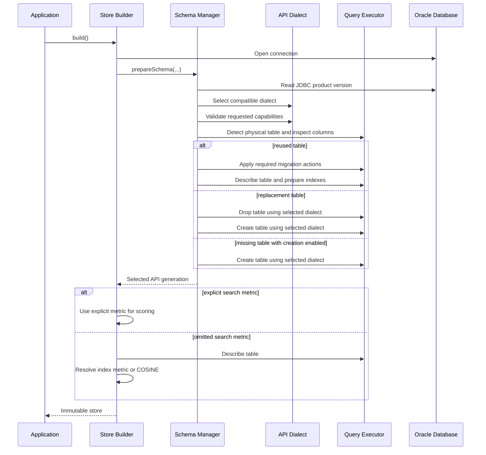

# Tracking

**Ticket:** SQLCL-8022

| Role | Owner/Reviewer | Status | Comments |
| --- | --- | --- | --- |
| Spec Author | Mohammed Amine El Hanafi |  |  |
| Spec Review |  |  |  |
| Developers | Mohammed Amine El Hanafi |  |  |

# Overview

This proposal adds a public VecDB-backed embedding store to the LangChain4j Oracle module. It is intended for
applications that want to store and search embeddings through Oracle VecDB while continuing to use the standard
LangChain4j `EmbeddingStore<TextSegment>` abstraction.

The proposed store is separate from the existing Oracle vector-column store. This separation is intentional:
`OracleEmbeddingStore` continues to represent the vector-column implementation, while
`OracleVecDbEmbeddingStore` represents the `DBMS_VECTOR_DATABASE` implementation. Applications choose the storage
model explicitly through the Java type they construct; no environment-variable backend switch is involved.

LangChain4j embedding models generate dense vectors before ingestion. VecDB owns its managed table, indexes, vector
storage, distance calculation, similarity search, and package-level schema operations. The integration translates
between these responsibilities without exposing VecDB PL/SQL signatures or response JSON as public Java contracts.

The existing upstream references are:

- [LangChain4j Oracle module](https://github.com/langchain4j/langchain4j/tree/main/langchain4j-oracle)
- [EmbeddingStore contract](https://github.com/langchain4j/langchain4j/blob/main/langchain4j-core/src/main/java/dev/langchain4j/store/embedding/EmbeddingStore.java)
- Existing store: `langchain4j-oracle/src/main/java/dev/langchain4j/store/embedding/oracle/OracleEmbeddingStore.java`

The public entry point is:

```java
dev.langchain4j.store.embedding.oracle.vecdb.OracleVecDbEmbeddingStore
```

## Goals

- Add a dedicated `EmbeddingStore<TextSegment>` for Oracle VecDB.
- Preserve the existing Oracle embedding store and its public API.
- Use bring-your-own-vector ingestion.
- Support generated IDs and IDs supplied by the application.
- Support individual and batch vector upserts.
- Preserve `TextSegment.text()` and supported LangChain4j metadata values.
- Support dense-vector search with maximum results, minimum score, and supported metadata filters.
- Translate supported LangChain4j filters into constrained VecDB QBE JSON for search.
- Support IVF and HNSW vector-index configuration.
- Support metadata-index configuration and lifecycle where the database version provides it.
- Support table creation, reuse, and replacement through the Oracle `CreateOption` enum.
- Support removal by ID, multiple IDs, metadata filter, and all rows.
- Describe the configured vector table through a reduced concrete-store API.
- Support Oracle Database 23.26.1 and later.
- Select the correct PL/SQL signatures, JSON shapes, response mapping, and feature capabilities from the connected
  database version.
- Inspect reused tables and migrate an earlier table layout when it is used on Oracle Database 23.26.3 or later.
- Support optional and independent index-time and search-time distance metrics.
- Convert every exposed metric's distance into a LangChain4j score in `[0, 1]`.
- Isolate PL/SQL, Oracle JDBC types, migration DDL, and JSON contracts behind executor and mapper boundaries.
- Keep store instances immutable and suitable for use with a thread-safe pooled `DataSource`.

## Non-Goals

- Changing the LangChain4j `EmbeddingStore` interface.
- Replacing or internally switching `OracleEmbeddingStore`.
- Database-side embedding generation or `CREATE_VECTOR_TABLE_FOR_MODEL` integration.
- Sparse-vector ingestion.
- Text, sparse, or hybrid search.
- Nested metadata objects beyond the LangChain4j flat `Metadata` contract.
- Automatically downgrading a 23.26.3 table to the 23.26.1/23.26.2 layout.
- Metadata indexes, parallel index creation, quantization, distribution, and other newer index options on the earlier
  API generation.
- `HAMMING` and `JACCARD` metrics for the FLOAT32 dense-vector contract.
- Automatically repairing an unrecognizable or unsafe physical table layout.
- Treating metric-specific LangChain4j scores as calibrated probabilities or as statistically comparable across
  different metrics.

## Key Design Decisions

### Separate Public Store

Applications construct `OracleVecDbEmbeddingStore` directly. Backend choice is visible in application code, and
VecDB-specific table and index configuration does not leak into the separate vector-column store.

### Bring-Your-Own Vectors

The integration accepts LangChain4j `Embedding` objects. The application selects and invokes the embedding model.
VecDB stores and searches the resulting vectors but does not generate them.

### Client-Generated IDs

Automatic database ID generation is disabled. Methods without an ID generate a UUID in Java; methods that receive an
ID preserve it. Stable IDs allow LangChain4j to return identifiers immediately and reuse them for upsert and deletion.

### Independent, Optional Distance Metrics

The vector-index metric and the store search metric are separate configuration values:

- `VecDbVectorIndex.distanceMetric(...)` controls the metric written into the vector-index definition.
- `OracleVecDbEmbeddingStore.Builder.distanceMetric(...)` controls the metric sent in
  `SEARCH.advanced_options.distance_metric`.
- Either value may be omitted. An omitted value is not serialized, allowing Oracle to apply its metric-selection rules.

The metric recommended by the embedding model should normally be used for both index creation and search. If an
explicit search metric conflicts with the vector-index metric, Oracle performs the requested calculation but cannot
use that vector index, so the operation becomes an exact search. The Java API allows this because index-time and
search-time configuration have distinct purposes.

When the search metric is omitted, the store still needs an effective metric for score conversion. After schema
preparation it reads the table description and uses the reported vector-index metric. If no vector index exists or no
metric is reported, the effective metric is `COSINE`, matching Oracle's default for a single unindexed vector column.

### Flat Metadata Only

LangChain4j metadata is a flat key-value map. For example, `author.country` is one literal metadata key; it is not
interpreted as the nested JSON path `$.author.country`. Search and deletion preserve this behavior.

### Dedicated Database Boundary

Store methods coordinate LangChain4j operations but do not contain PL/SQL call signatures or response parsing.
Version dialects own changed package signatures, mappers own JSON translation, the schema manager owns lifecycle
decisions, and the JDBC executor owns database-resource mechanics.

# Contracts and Compatibility

The integration connects a stable Java abstraction to a database package whose signatures and managed table shape
changed between Oracle Database 23.26.1 and 23.26.3. LangChain4j defines IDs, embedded-object semantics, filters,
ordered matches, and relevance scores. VecDB defines physical storage, indexes, package operations, and distance
calculation.

`DBMS_VECTOR_DATABASE` is therefore treated as a versioned database boundary. Vector upsert, search, listing, and ID
deletion share signatures across supported releases, while table lifecycle operations, index JSON, description JSON,
and physical table layout depend on the connected database version. Store construction resolves the API generation
once and uses it consistently for schema preparation, table description, index mapping, and version-specific PL/SQL.

## LangChain4j EmbeddingStore

The primary contract is:

```java
public final class OracleVecDbEmbeddingStore
        implements EmbeddingStore<TextSegment>
```

The store follows these LangChain4j abstractions:

| Type | Contract used by the VecDB integration |
| --- | --- |
| `Embedding` | Dense `float[]` generated by an embedding model |
| `TextSegment` | Text and non-null metadata |
| `Metadata` | Flat keys with supported scalar values |
| `EmbeddingSearchRequest` | Query embedding, maximum results, minimum score, and optional filter |
| `EmbeddingSearchResult` | Ordered collection of matches |
| `EmbeddingMatch` | Score, ID, returned embedding, and reconstructed text segment |
| `Filter` | Metadata expression tree requiring database-specific translation |

## DBMS_VECTOR_DATABASE

| Capability | Database mechanism |
| --- | --- |
| Detect a physical table | JDBC `DatabaseMetaData` |
| Inspect physical columns | JDBC `DatabaseMetaData.getColumns(...)` |
| List VecDB catalog tables | `LIST_VECTOR_TABLES` |
| Create table | Version-specific `CREATE_VECTOR_TABLE` |
| Describe table | Version-specific `DESCRIBE_VECTOR_TABLE` |
| Drop table | Version-specific `DROP_VECTOR_TABLE` |
| Create indexes | `CREATE_INDEX` |
| Drop indexes | `DROP_INDEX` |
| Rebuild indexes | `REBUILD_INDEX` |
| Add or replace vectors | `UPSERT_VECTORS` |
| Page through vectors | `LIST_VECTORS` |
| Similarity search | `SEARCH` |
| Delete vectors by ID | `DELETE_VECTORS` |
| Delete by filter or delete all rows | Direct parameterized SQL DML |

A physical table check cannot rely only on `LIST_VECTOR_TABLES`. After a database upgrade, an earlier VecDB table may
still exist in the schema even when the newer catalog response does not recognize it. JDBC metadata prevents
`CREATE_IF_NOT_EXISTS` from incorrectly attempting to recreate that table and failing with `ORA-00955`.

# Target Architecture

The public store coordinates LangChain4j operations. Immutable configuration types capture application intent.
Mappers translate structured Java values and version-specific JSON. The schema manager converts builder intent into a
deterministic lifecycle. The executor performs Oracle JDBC, PL/SQL, DML, and DDL operations.

## Package and Class Layout

### Public Types

| Type | Purpose |
| --- | --- |
| `OracleVecDbEmbeddingStore` | Implements `EmbeddingStore<TextSegment>` and coordinates ingestion, search, deletion, schema preparation, table description, and connection ownership |
| `OracleVecDbEmbeddingStore.VectorTableDescription` | Immutable reduced description containing table name, comment, and annotations |
| `VecDbEmbeddingTable` | Table name, optional comment, annotations, and table lifecycle |
| `VecDbVectorIndex` | Immutable IVF or HNSW vector-index configuration |
| `VecDbIvfIndexBuilder` | IVF partition and shared vector-index configuration |
| `VecDbHnswIndexBuilder` | HNSW graph, rescoring, quantization, and distribution configuration |
| `VecDbMetadataIndex` | Metadata-path selection, automatic maintenance, and lifecycle configuration |
| `VecDbDistributeParameters` | Optional HNSW distribution settings |
| `VecDbDistanceMetric` | FLOAT32 metrics for which the store defines a score conversion |
| `VecDbIndexOrganization` | IVF partitions or HNSW in-memory graph organization |
| `VecDbQuantizationType` | Quantization mode |
| `VecDbQuantizationAlgorithm` | Advanced quantization algorithm and database JSON value |

### Internal Types

Mapping classes live in `dev.langchain4j.store.embedding.oracle.vecdb.mapper`. Other internal components live in the
parent `dev.langchain4j.store.embedding.oracle.vecdb` package.

| Type | Responsibility |
| --- | --- |
| `VecDbSchemaManager` | Coordinates version gating, capability validation, table lifecycle, layout migration, and independent index lifecycles |
| `VecDbQueryExecutor` | Defines database operations without exposing JDBC mechanics to the store or schema manager |
| `VecDbJdbcQueryExecutor` | Executes PL/SQL and DML, binds Oracle JSON, reads CLOBs, inspects JDBC metadata, and applies migration DDL |
| `VecDbApiVersion` | Identifies the earlier or newer supported API generation |
| `VecDbApiDialect` | Supplies version-specific call signatures, parameter bindings, index mapping, and capability validation |
| `VecDbApiDialectLegacy` | Implements the Oracle Database 23.26.1/23.26.2 package contract |
| `VecDbApiDialectNew` | Implements the Oracle Database 23.26.3-and-later package contract |
| `VecDbTableLayout` | Classifies normalized physical columns as earlier, newer, partially migrated, or incompatible |
| `VecDbTableMigration` | Produces ordered, resumable actions needed to align a reused table with the selected API generation |
| `VecDbEmbeddingTableJsonMapper` | Maps table JSON, parses both description shapes, discovers index state, and resolves the effective metric |
| `VecDbIndexJsonMapper` | Produces nested vector/metadata index JSON for 23.26.3 and later |
| `VecDbIndexJsonMapperLegacy` | Produces flat vector-index JSON for 23.26.1/23.26.2 and rejects unsupported managed features |
| `VecDbVectorJsonMapper` | Serializes upsert records and ID arrays and parses listed vectors |
| `VecDbSearchRequestMapper` | Maps search requests to query JSON, QBE filters, top-k, vector inclusion, and optional search options |
| `VecDbSearchResultMapper` | Converts distances into scores and reconstructs embeddings and text segments |
| `VecDbFilters` | Translates supported LangChain4j filters into constrained QBE and validates deletion filters |
| `VecDbSupport` | Parses the JDBC product version, enforces the minimum, and selects the API generation |
| `VecDbIndexBuilder` | Shares validation and fluent configuration between IVF and HNSW builders |

## Runtime Architecture



Capability validation occurs before table discovery, migration, drop, or creation. This prevents
`CREATE_OR_REPLACE` from deleting a table before the application learns that a requested metadata index, parallel
creation setting, or advanced index option is unavailable on the connected database version.

# Public API and Data Model

The builder expresses table and index intent before construction, while store methods follow the
`EmbeddingStore<TextSegment>` contract.

## Public API Design

### Minimal Existing-Table Usage

```java
OracleVecDbEmbeddingStore store = OracleVecDbEmbeddingStore.builder()
        .dataSource(dataSource)
        .embeddingTable("MY_VECTORS")
        .build();
```

This configuration uses `CreateOption.CREATE_NONE`, so the table must already exist.

### Table Creation

```java
VecDbEmbeddingTable table = VecDbEmbeddingTable.builder()
        .name("MY_VECTORS")
        .comment("LangChain4j text embeddings")
        .annotation("application", "knowledge-search")
        .createOption(CreateOption.CREATE_IF_NOT_EXISTS)
        .build();
```

### Index and Search-Metric Configuration

```java
VecDbVectorIndex vectorIndex = VecDbVectorIndex.hnswIndexBuilder()
        .distanceMetric(VecDbDistanceMetric.COSINE)
        .accuracy(90)
        .neighbors(32)
        .efConstruction(200)
        .createOption(CreateOption.CREATE_IF_NOT_EXISTS)
        .build();

VecDbMetadataIndex metadataIndex = VecDbMetadataIndex.builder()
        .autoIndex(true)
        .createOption(CreateOption.CREATE_IF_NOT_EXISTS)
        .build();

OracleVecDbEmbeddingStore store = OracleVecDbEmbeddingStore.builder()
        .dataSource(dataSource)
        .embeddingTable(table)
        .index(vectorIndex)
        .distanceMetric(VecDbDistanceMetric.COSINE)
        .metadataIndex(metadataIndex)
        .parallelCreation(4)
        .build();
```

The metadata-index and parallel-creation settings in this example require Oracle Database 23.26.3 or later. Both
distance-metric calls are optional. Calling neither allows Oracle to choose the metric.

### Store Builder Contract

| Builder method | Required | Meaning |
| --- | --- | --- |
| `dataSource(DataSource)` | Yes | Supplies JDBC connections |
| `embeddingTable(String)` | One table method required | Reuses an existing table with `CREATE_NONE` |
| `embeddingTable(String, CreateOption)` | One table method required | Configures table name and lifecycle |
| `embeddingTable(VecDbEmbeddingTable)` | One table method required | Supplies the complete table configuration |
| `index(VecDbVectorIndex)` | No | Configures the vector index and its lifecycle |
| `distanceMetric(VecDbDistanceMetric)` | No | Configures the independent search-time metric |
| `metadataIndex(VecDbMetadataIndex)` | No | Configures metadata indexing on supported releases |
| `parallelCreation(int)` | No | Configures current-generation index-creation parallelism |
| `build()` | Yes | Resolves compatibility, prepares schema, and resolves the effective scoring metric |

### VecDB-Specific Table Description

The concrete store exposes selected fields from `DBMS_VECTOR_DATABASE.DESCRIBE_VECTOR_TABLE`:

```java
OracleVecDbEmbeddingStore.VectorTableDescription description =
        store.describeVectorTable();
```

The result contains only `tableName`, `comment`, and an immutable `annotations` map. Because this method is outside
`EmbeddingStore`, callers that need it must retain the concrete `OracleVecDbEmbeddingStore` type.

Description mapping is case-insensitive. It reads the newer `comment` property and falls back to the earlier
`description` property.

## Data Model

### VecDB Physical Table

The physical layout depends on the release that created the table.

| API generation | Physical columns |
| --- | --- |
| Oracle Database 23.26.1/23.26.2 API | `ID`, `DENSE_VECTOR`, `METADATA` |
| Oracle Database 23.26.3-and-later API | `ID`, `DENSE_VECTOR`, `CONTENT_METADATA`, `SPARSE_VECTOR`, `CONTENT`, `CONTENT_TYPE` |

The logical upsert property remains `metadata`. It maps to `METADATA` in the earlier layout and `CONTENT_METADATA` in
the newer layout. Text is stored under reserved metadata key `text` so a search response can reconstruct a
`TextSegment`.

`CONTENT` and `CONTENT_TYPE` belong to the newer physical layout, but column presence does not prove that
`UPSERT_VECTORS` accepts plain JSON text and writes it to the BLOB. Until that behavior is verified, text remains in
metadata and BLOB ingestion remains a separate decision.

### Table Creation Parameters

The table mapper prepares a bring-your-own-vector table. Database ID generation is disabled because the store generates
UUIDs or accepts IDs supplied by the application.

The representation depends on the database version:

- Oracle Database 23.26.1/23.26.2 receives `auto_generate_id => FALSE` and `vector_type => 'dense'` as direct function
  parameters.
- Oracle Database 23.26.3 and later receives `{"auto_generate_id":false}` through `table_params` and receives
  `embed_params => NULL`.

Both APIs receive the table name, optional comment/description, optional annotations, and optional compatible index
parameters. No database embedding model is configured.

### Vector-Only Record

```json
{
  "id": "generated-or-application-id",
  "dense_vector": [0.1, 0.2, 0.3]
}
```

This record contains no text or metadata. The ID may be generated by the store or supplied by the application.

### TextSegment Record

```json
{
  "id": "generated-or-application-id",
  "dense_vector": [0.1, 0.2, 0.3],
  "metadata": {
    "tenant": "acme",
    "text": "Oracle vector search"
  }
}
```

The mapper copies user metadata and adds `TextSegment.text()` under reserved key `text`. During result mapping, that
key is removed from `Metadata` and used to reconstruct the segment. User metadata containing `text` is rejected to
avoid conflicting values.

## EmbeddingStore Operation Contracts

### Add and Upsert

All add operations use `UPSERT_VECTORS`.

| Method | ID behavior | Stored values | Return |
| --- | --- | --- | --- |
| `add(Embedding)` | Generate UUID | ID and dense vector | Generated ID |
| `add(String, Embedding)` | Use application ID | ID and dense vector | `void` |
| `add(Embedding, TextSegment)` | Generate UUID | ID, vector, text, and metadata | Generated ID |
| `addAll(List<Embedding>)` | Generate ordered UUID list | Array of vector-only records | Ordered IDs |
| `addAll(List<Embedding>, List<TextSegment>)` | LangChain4j generates IDs | Array of complete records | Ordered IDs |
| `addAll(List<String>, List<Embedding>, List<TextSegment>)` | Use application IDs | Array of complete records | `void` |

Application-provided IDs give these methods upsert semantics. IDs must be non-blank; list entries must be non-null; and
parallel lists must have equal sizes.

### Search

```java
EmbeddingSearchResult<TextSegment> search(EmbeddingSearchRequest request)
```

The operation maps the dense query embedding, maximum result count, supported metadata filter, vector-inclusion flag,
and optional search-time metric into one VecDB `SEARCH` call. Returned matches preserve VecDB ordering.

For every result, the mapper converts the returned distance using the effective metric and reconstructs the
`TextSegment` from stored text and metadata. `minScore` is applied locally after conversion, so the result may contain
fewer entries than `maxResults`.

### Removal

| Method | Behavior |
| --- | --- |
| `remove(String)` | Use the LangChain4j default path through one-ID collection removal |
| `removeAll(Collection<String>)` | Serialize IDs and call `DELETE_VECTORS` |
| `removeAll(Filter)` | Validate the filter, map it to a SQL JSON predicate, execute one parameterized `DELETE`, and commit when needed |
| `removeAll()` | Execute `DELETE FROM <table>`, commit when needed, and preserve table and indexes |

### Describe Table

`describeVectorTable()` calls the version-compatible `DESCRIBE_VECTOR_TABLE` signature and returns only the table
name, comment, and annotations. Other response fields remain internal.

# Schema and Index Management

Schema preparation translates builder configuration into a deterministic sequence of VecDB operations. Table and
index lifecycles remain independent: reusing a table does not imply replacing its indexes, and replacing a metadata
index does not affect the vector index.

## Schema Preparation

`VecDbSchemaManager` owns lifecycle decisions. It borrows the connection opened by the store and does not close it.
`VecDbQueryExecutor` executes each operation selected by the schema manager.

The database version is resolved before any table or index operation. Oracle Database 23.26.1 and 23.26.2 select the
earlier API generation; Oracle Database 23.26.3 and later select the newer API generation. The dialect determines table
PL/SQL signatures, root index JSON, description parsing, supported schema features, and expected physical layout.

### API Generation Selection

| Database version | API version | Dialect |
| --- | --- | --- |
| Earlier than 23.26.1 | Unsupported | None |
| 23.26.1 or 23.26.2 | `V23_26_1` | `VecDbApiDialectLegacy` |
| 23.26.3 or later | `V23_26_3` | `VecDbApiDialectNew` |

Capability validation happens before discovery or mutation. Current-only features therefore fail before migration,
drop, create, or index operations begin.

### Physical Table Discovery and Layout Migration

Table lifecycle first asks whether the physical table exists, then inspects its columns, and finally decides whether
the layout matches the selected API generation. Physical existence uses JDBC metadata rather than only the VecDB
catalog.

| Layout state | Meaning |
| --- | --- |
| Earlier | `ID`, `DENSE_VECTOR`, and `METADATA` are present with no newer content columns |
| Newer | All six newer columns are present |
| Partially migrated | A recognized metadata column exists but one or more newer columns are missing |
| Incompatible | Required base columns are missing, both metadata columns coexist, or migration is unsafe |

On Oracle Database 23.26.3 and later, only missing migration actions are executed:

```sql
ALTER TABLE <table> RENAME COLUMN METADATA TO CONTENT_METADATA;
ALTER TABLE <table> ADD SPARSE_VECTOR VECTOR(*, *, SPARSE);
ALTER TABLE <table> ADD CONTENT BLOB;
ALTER TABLE <table> ADD CONTENT_TYPE VARCHAR2(256);
```

The layout is inspected again afterward. Remaining actions cause store construction to fail. This makes interrupted
migrations resumable. A newer layout on 23.26.1/23.26.2 is rejected because automatic downgrade is not supported.

### Table Lifecycle

| Table option | Table missing | Table present |
| --- | --- | --- |
| `CREATE_NONE` | Fail fast | Reuse, inspect/migrate, and process configured index lifecycles |
| `CREATE_IF_NOT_EXISTS` | Create | Reuse, inspect/migrate, and process configured index lifecycles |
| `CREATE_OR_REPLACE` | Create | Drop data, table, and indexes, then create from current configuration |

Replacing a table is destructive. Compatibility and capability checks must finish before the drop occurs.

### Vector Index Lifecycle

| Vector-index option | Index missing | Index present |
| --- | --- | --- |
| `CREATE_NONE` | No action | No action |
| `CREATE_IF_NOT_EXISTS` | `CREATE_INDEX` | No action |
| `CREATE_OR_REPLACE` | `CREATE_INDEX` | `REBUILD_INDEX` |

### Metadata Index Lifecycle

| Metadata-index option | Index missing | Index present |
| --- | --- | --- |
| `CREATE_NONE` | No action | No action |
| `CREATE_IF_NOT_EXISTS` | `CREATE_INDEX` | No action |
| `CREATE_OR_REPLACE` | `CREATE_INDEX` | Drop metadata indexes, then `CREATE_INDEX` |

Managed metadata indexes require Oracle Database 23.26.3 or later. A metadata index configured with
`CREATE_IF_NOT_EXISTS` or `CREATE_OR_REPLACE` on 23.26.1/23.26.2 fails before schema mutation.

### Index-State Discovery

For 23.26.1/23.26.2 responses, a non-blank `DENSE_IDX_NAME` proves that the vector index exists. Flat `INDEX_PARAMS`
describes configuration but does not prove physical index existence. Metadata-index status is always false because the
earlier API does not support metadata indexes.

For 23.26.3-and-later responses, the mapper reads explicit index entries first. If those are unavailable, it falls back
to nested `INDEX_PARAMS.vector_index_params` and `INDEX_PARAMS.metadata_index_params`, including configured metadata
paths.

## Vector Index Design

### Root Index Parameters

Oracle Database 23.26.1/23.26.2 accepts a flat vector-index document:

```json
{
  "indexing": "auto",
  "organization": "INMEMORY GRAPH",
  "distance_metric": "COSINE",
  "accuracy": 90,
  "advanced_params": {
    "neighbors": 32,
    "efConstruction": 200
  }
}
```

The earlier mapper returns null when no managed vector index is requested. It does not support metadata-index or
parallel-creation properties.

Oracle Database 23.26.3 and later accepts a nested root document:

```json
{
  "vector_index_params": {
    "auto_index": true,
    "organization": "INMEMORY GRAPH",
    "distance_metric": "COSINE",
    "accuracy": 90,
    "advanced_params": {
      "neighbors": 32,
      "efConstruction": 200
    }
  },
  "metadata_index_params": {
    "auto_index": true
  },
  "parallel_creation": 4
}
```

If vector index, metadata index, and parallel creation are all absent, `index_params` is null. In the newer JSON,
`CREATE_NONE` can be represented through `auto_index: false`. `CreateOption` itself is never serialized as an enum
name; the schema manager uses it for lifecycle decisions.

In both versions, `distance_metric` is omitted when it is not configured.

### Shared Vector-Index Configuration

| Builder property | JSON property | Validation/default |
| --- | --- | --- |
| `distanceMetric` | `distance_metric` | Optional; omission delegates selection to Oracle |
| `accuracy` | `accuracy` | Optional integer from 0 through 100 |
| `quantizationType` | `quantization_type` | `NONE` or `SCALAR`; requires 23.26.3+ |
| `compressionRatio` | `compression_ratio` | 2, 4, or 8 with scalar quantization; requires 23.26.3+ |
| `onlineBuild` | `online_build` | Optional boolean; requires 23.26.3+ |
| `createOption` | Lifecycle and `auto_index` | Defaults to `CREATE_NONE` |

Builder validation runs before database operations. Dialect capability validation then rejects configured features that
the connected release cannot express.

### IVF Index

```java
VecDbVectorIndex.ivfIndexBuilder()
```

IVF maps to `organization: "PARTITIONS"`.

| Property | JSON location | Validation |
| --- | --- | --- |
| `partitions` | `advanced_params.partitions` | 1 through 10,000,000 |

### HNSW Index

```java
VecDbVectorIndex.hnswIndexBuilder()
```

HNSW maps to `organization: "INMEMORY GRAPH"`.

| Property | JSON location | Validation/version |
| --- | --- | --- |
| `neighbors` | `advanced_params.neighbors` | 1 through 2,048; both API generations |
| `efConstruction` | `advanced_params.efConstruction` | 1 through 65,535; both API generations |
| `rescoreFactor` | `advanced_params.rescore_factor` | 1 through 100; requires 23.26.3+ |
| `quantizationAlgorithm` | `advanced_params.algorithm` | Scalar quantization and 23.26.3+ required |
| `distributeParameters` | `distribute_params` | Method, service, or both; requires 23.26.3+ |

`VecDbDistributeParameters` rejects a configuration where both distribution method and service name are absent.

### Distance Metric Consistency

The metric recommended by the embedding model should be used consistently for index creation and search. Index-time
and search-time metrics remain independent and optional. When either is omitted, the corresponding JSON property is
omitted and Oracle applies its selection rules.

If an explicit search metric differs from the index metric, Oracle cannot use that index and performs exact distance
evaluation with the requested search metric. This is allowed but should be intentional.

The store exposes these dense FLOAT32 metrics:

- `COSINE`
- `MANHATTAN`
- `DOT`
- `EUCLIDEAN`
- `L2_SQUARED`
- `EUCLIDEAN_SQUARED`

`HAMMING` and `JACCARD` are not exposed because they require binary-vector semantics rather than the FLOAT32 vectors
used by this store. For example, maintaining a HAMMING index with FLOAT32 vectors can fail with `ORA-51883`.

## Metadata Index Design

Metadata-index configuration requires Oracle Database 23.26.3 or later.

| Property | Purpose |
| --- | --- |
| `autoIndex` | Lets VecDB discover and maintain qualifying metadata paths automatically |
| `includePaths` | Explicitly eligible metadata paths |
| `excludePaths` | Metadata paths excluded from indexing |
| `createOption` | Existing index lifecycle |

`createOption` controls whether schema preparation creates, reuses, or replaces the metadata index. `autoIndex`
controls how VecDB discovers and maintains metadata paths. These are independent concepts.

Paths are passed to VecDB after non-blank validation. `includePaths` and `excludePaths` cannot both contain wildcard
`*`. Explicit paths should target filterable business fields such as `tenant`, `category`, or `documentId`. The
reserved `text` property can be large and is unavailable to LangChain4j filters, so automatic indexing of it remains a
documented consideration.

# Search, Filtering, and Removal Behavior

VecDB performs vector comparison, result ordering, and QBE metadata filtering. The integration converts database
distances into LangChain4j scores and reconstructs `TextSegment` objects. Removal follows the same LangChain4j filter
surface but uses direct database DML where VecDB provides no filter-delete package operation.

## Search Architecture

### Request Mapping

| LangChain4j/store input | VecDB input | Purpose |
| --- | --- | --- |
| `queryEmbedding()` | `query_by = {"vector":[...]}` | Supplies the dense query vector |
| `maxResults()` | `top_k` | Limits nearest results |
| `filter()` | QBE `filters` JSON or typed JSON null | Applies supported metadata conditions |
| Explicit store metric | `advanced_options.distance_metric` | Selects the query-time metric |
| Omitted store metric | `advanced_options = NULL` | Delegates metric selection to Oracle |
| Result reconstruction | `include_vectors = TRUE` | Returns stored vectors for `EmbeddingMatch` |

`EmbeddingSearchRequest.query()` remains outside the dense-vector delivery. Index construction parameters such as
partitions, graph neighbors, quantization, index accuracy, and parallel creation are not search options and are not
copied into `advanced_options`.

### Effective Metric Resolution

| Configuration | Search request | Score-conversion metric |
| --- | --- | --- |
| Store metric supplied | Send explicit metric | Explicit store metric |
| Store metric omitted, vector index reports metric | Omit metric | Reported index metric |
| Store metric omitted, no vector index | Omit metric | `COSINE` |
| Store metric omitted, index reports no metric | Omit metric | `COSINE` |

For 23.26.1/23.26.2 descriptions, vector-index existence comes from `DENSE_IDX_NAME` and the metric comes from flat
`INDEX_PARAMS.distance_metric`. For 23.26.3-and-later descriptions, the metric comes from
`INDEX_PARAMS.vector_index_params.distance_metric` after determining that the vector index exists.

An existing index that reports a metric outside the public enum causes `UnsupportedFeatureException`. Applying an
incorrect conversion formula would violate the LangChain4j scoring contract.

### Result Mapping

The response must contain a root `results` array. Each result is read from:

- `id`: non-blank embedding ID.
- `distance`: finite distance interpreted with the effective metric.
- `vector`: optional dense vector.
- `metadata`: optional object containing reserved text and user metadata.

The mapper removes reserved `text` before constructing returned `Metadata`. Missing text produces a null embedded
object rather than a fabricated segment.

### Score Conversion

VecDB returns distances; LangChain4j expects a higher-is-better score in `[0, 1]`.

| Metric | Valid distance | Score formula |
| --- | --- | --- |
| `COSINE` | `[0, 2]` | `1 - (distance / 2)` |
| `EUCLIDEAN` | `distance >= 0` | `1 / (1 + distance)` |
| `MANHATTAN` | `distance >= 0` | `1 / (1 + distance)` |
| `L2_SQUARED` | `distance >= 0` | `1 / (1 + sqrt(distance))` |
| `EUCLIDEAN_SQUARED` | `distance >= 0` | `1 / (1 + sqrt(distance))` |
| `DOT` | Any finite value | `clamp(-distance, 0, 1)` |

Cosine distance `0` maps to score `1`, distance `1` maps to `0.5`, and distance `2` maps to `0`. Squared Euclidean
forms take the square root before applying the Euclidean score mapping.

Oracle DOT distance is the negated inner product, so negating it restores a higher-is-better value. Clamping satisfies
the LangChain4j range but is not universal probability calibration; inner products outside `[0, 1]` can saturate.

`minScore` is applied locally after VecDB returns top-k. No over-fetch is performed, so fewer than `maxResults` may be
returned.

## Metadata Filter Architecture

### Translation Design

LangChain4j `Filter` is an in-memory expression tree, while VecDB search expects QBE JSON. `VecDbFilters` owns this
database-specific translation through:

- A registry keyed by exact supported filter class.
- A functional translator for each filter type.
- A `FilterRule` containing normal and negated operators.
- An `OperandKind` validating scalar, ordered, or collection values.
- A `TranslationContext` carrying whether the current expression is negated.

The context applies operator inversion and De Morgan's law without creating a second Java expression tree.

### Operator Mapping

| LangChain4j filter | Normal QBE | Under `Not` |
| --- | --- | --- |
| `IsEqualTo` | `$eq` | `$ne` |
| `IsNotEqualTo` | `$ne` | `$eq` |
| `IsGreaterThan` | `$gt` | `$lte` plus missing-field branch |
| `IsGreaterThanOrEqualTo` | `$gte` | `$lt` plus missing-field branch |
| `IsLessThan` | `$lt` | `$gte` plus missing-field branch |
| `IsLessThanOrEqualTo` | `$lte` | `$gt` plus missing-field branch |
| `IsIn` | `$in` | `$nin` |
| `IsNotIn` | `$nin` | `$in` |
| `And` | `$and` | `$or` with negated operands |
| `Or` | `$or` | `$and` with negated operands |

For `NOT(age > 18)`, missing metadata must also match because the original comparison is false when `age` is absent:

```json
{
  "$or": [
    {"age": {"$lte": 18}},
    {"age": {"$exists": false}}
  ]
}
```

### Filter Constraints

- Supported scalar values: `String`, `UUID`, `Integer`, `Long`, finite `Float`, and finite `Double`.
- Ordered operators accept strings and numbers.
- Collection operators require a non-empty collection of supported scalar values.
- UUID values are serialized as strings.
- Null, Boolean, arbitrary object, and non-finite numeric values are rejected.
- Reserved key `text` is rejected.
- Keys beginning with `$` or containing `.`, `[`, `]`, or backticks are rejected.
- Logical nesting is supported; nested JSON metadata paths are not.
- `ContainsString` is unsupported because Oracle Text `$contains` does not provide the same simple substring semantics.

Unsupported filters raise `UnsupportedFeatureException` before JDBC execution.

## Removal Design

### Deletion by ID

One or more non-blank IDs are serialized as a JSON array and passed to `DELETE_VECTORS`. Empty ID collections are
rejected.

### Deletion by Filter

`removeAll(Filter)` performs one direct DML operation instead of searching and paging IDs:

```sql
DELETE FROM <table> WHERE <translated-metadata-predicate>
```

The filter is first validated by `VecDbFilters`, keeping deletion aligned with the supported search filter surface.
The SQL translator maps flat metadata keys to `JSON_VALUE` expressions and binds all values through a
`PreparedStatement`.

The physical metadata column is version-dependent: deletion uses `METADATA` for the 23.26.1/23.26.2 layout and
`CONTENT_METADATA` for the 23.26.3-and-later layout. The operation commits when auto-commit is disabled.

This direct approach avoids search top-k limits, paging races, duplicate IDs, and changes between search and deletion.

### Removing All Records

`removeAll()` executes:

```sql
DELETE FROM <table>
```

It does not truncate, drop, or recreate the table. The table, annotations, vector index, and metadata indexes remain.
The store commits when auto-commit is disabled.

# Database Integration and Operational Model

## Executor and JDBC Design

### Executor Contract

```java
interface VecDbQueryExecutor {
    boolean vectorTableExists(Connection connection, String tableName);
    VecDbTableLayout inspectTableLayout(Connection connection, String tableName);
    void applyTableMigration(Connection connection, String tableName, MigrationAction action);
    String createVectorTable(Connection connection, VecDbApiVersion version, ...);
    String describeVectorTable(Connection connection, String tableName, VecDbApiVersion version);
    String dropVectorTable(Connection connection, String tableName, VecDbApiVersion version);
    IndexStatus indexStatus(Connection connection, String tableName, VecDbApiVersion version);
    String createIndex(...);
    String dropIndex(...);
    String rebuildIndex(...);
    String upsertVectors(...);
    String listVectors(...);
    String search(...);
    String deleteVectors(...);
    int deleteVectorsByFilter(...);
    int deleteAllVectors(...);
}
```

The store owns connections obtained from its `DataSource` and closes them with try-with-resources. The schema manager
borrows a connection and chooses lifecycle operations without closing it. The executor owns statements, readers,
returned CLOB cleanup, and individual database calls.

String-returning package methods expose raw JSON only to dedicated internal mappers. `IndexStatus` gives the schema
manager a stable view of vector and metadata index existence across response versions.

### CallableStatement Pattern

Every package function returns a CLOB. The shared call helper:

1. Prepares a PL/SQL block.
2. Registers parameter 1 as `OracleTypes.CLOB`.
3. Runs operation-specific binder callbacks.
4. Executes the statement.
5. Reads the CLOB through a character stream.
6. Frees the CLOB and closes the statement.

### JSON Binding

JSON inputs are created with `OracleJsonFactory` and bound as `OracleType.JSON`. Missing optional JSON is bound as a
typed JSON null rather than an untyped SQL null.

### Version-Specific Package Parameters

| Function | Oracle Database 23.26.1/23.26.2 | Oracle Database 23.26.3+ |
| --- | --- | --- |
| `CREATE_VECTOR_TABLE` | `table_name`, `description`, `auto_generate_id`, `annotations`, `vector_type`, flat `index_params` | `name`, `comment`, `annotations`, `table_params`, `embed_params`, nested `index_params` |
| `DESCRIBE_VECTOR_TABLE` | `table_name` | `name` |
| `DROP_VECTOR_TABLE` | `table_name` | `name` |

The earlier create call explicitly binds `auto_generate_id => FALSE`, `vector_type => 'dense'`,
`debug_flags => NULL`, and `request_id => NULL`. Optional debug flags and request IDs are omitted from describe and
drop because their defaults are sufficient.

### Shared Package Parameters

| Function | Bound inputs | Returned value |
| --- | --- | --- |
| `CREATE_INDEX` | `table_name`, `index_params` | Status CLOB |
| `DROP_INDEX` | `table_name`, `index_params` | Status CLOB |
| `REBUILD_INDEX` | `table_name`, `index_params` | Status CLOB |
| `UPSERT_VECTORS` | `table_name`, `vectors` | Upsert status CLOB |
| `LIST_VECTORS` | `table_name`, optional `ids`, `limit`, `offset` | Paged vector CLOB |
| `SEARCH` | `table_name`, `query_by`, optional `filters`, `top_k`, `include_vectors`, `advanced_options` | Search result CLOB |
| `DELETE_VECTORS` | `table_name`, `ids` | Delete status CLOB |

Direct deletion uses SQL because the package deletion operation accepts IDs rather than metadata filters. Oracle
object names cannot be JDBC bind values, so the configured table name is a trusted application configuration boundary.
Filter values remain bound parameters.

## Version Capability Gate

VecDB operations require Oracle Database 23.26.1 or later. Compatibility is checked during store construction so an
unsupported database or feature fails before schema or data operations begin.

The version utility:

- Reads `DatabaseMetaData.getDatabaseProductVersion()`.
- Finds complete three-component versions such as `23.26.3`.
- Uses the last complete match because a product string can contain both release and full-version values.
- Compares major, minor, and patch numerically.
- Rejects versions below 23.26.1 with `UnsupportedFeatureException`.
- Selects `V23_26_1` for 23.26.1 and 23.26.2.
- Selects `V23_26_3` for 23.26.3 and later.
- Rejects an unparseable product version with `IllegalStateException`.

## Validation and Error Model

### Builder Validation

- `DataSource` and embedding-table configuration are required.
- Table names and optional comments must be non-blank.
- Annotation names must be non-blank and values non-null.
- Parallel creation must be positive and requires the newer API generation.
- Store and vector-index distance metrics are optional.
- An explicit metric must be one of the FLOAT32 metrics exposed by `VecDbDistanceMetric`.
- Search/index metric mismatch is allowed and produces Oracle's documented exact-search fallback.
- Managed current-only index features are rejected on 23.26.1/23.26.2 before schema mutation.

### Ingestion Validation

- Embeddings, segments, and IDs must be non-null.
- IDs must be non-blank.
- Batch lists must have equal sizes and non-null entries.
- User metadata must not contain reserved key `text`.
- Empty embedding batches return an empty ID list without a database call.
- Empty deletion ID collections fail validation.

### Index Validation

- Accuracy is between 0 and 100.
- Scalar quantization requires a compression ratio.
- Compression ratio requires scalar quantization and is 2, 4, or 8.
- Advanced quantization algorithm requires scalar quantization.
- IVF partitions are between 1 and 10,000,000.
- HNSW neighbors are between 1 and 2,048.
- HNSW `efConstruction` is between 1 and 65,535.
- HNSW rescore factor is between 1 and 100.
- Distributed HNSW configuration contains a method, service name, or both.

### Compatibility Validation

- A reused table must have an accepted or safely migratable physical layout.
- A newer layout on the earlier database generation is rejected; no automatic downgrade occurs.
- Migration is re-inspected after DDL and fails if required actions remain.
- A vector-index metric discovered from the database must have a supported LangChain4j score conversion.
- Version-specific response fields are parsed case-insensitively and validated before use.

### Error Categories

| Category | Exception direction |
| --- | --- |
| Invalid user configuration | `IllegalArgumentException` or validation utility exception |
| Unsupported database version, feature, or discovered metric | `UnsupportedFeatureException` |
| Missing required table or incompatible layout | `IllegalStateException` |
| Malformed VecDB response | `IllegalStateException` at the mapper boundary |
| JDBC or package failure | Runtime wrapper retaining the original `SQLException` cause |
