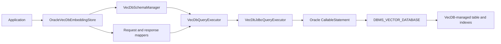
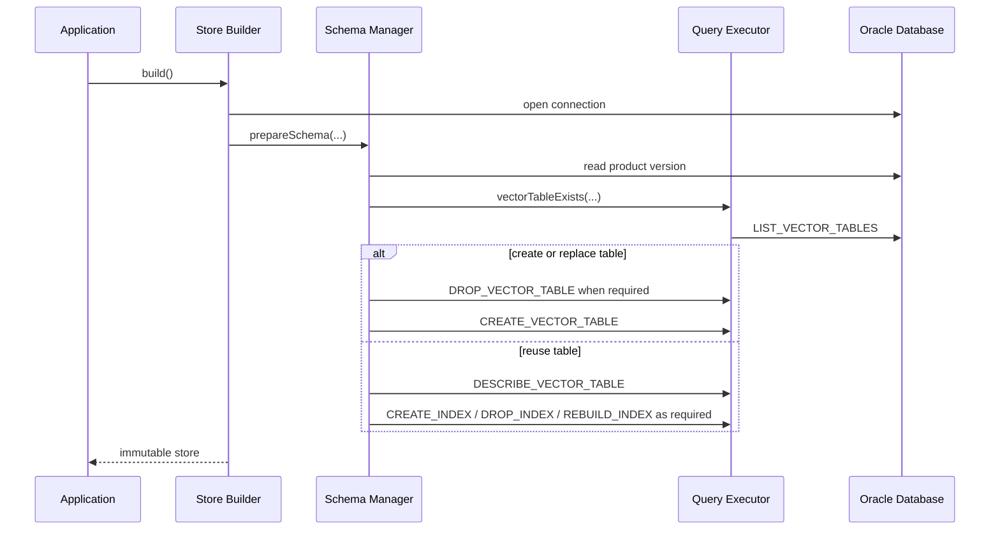
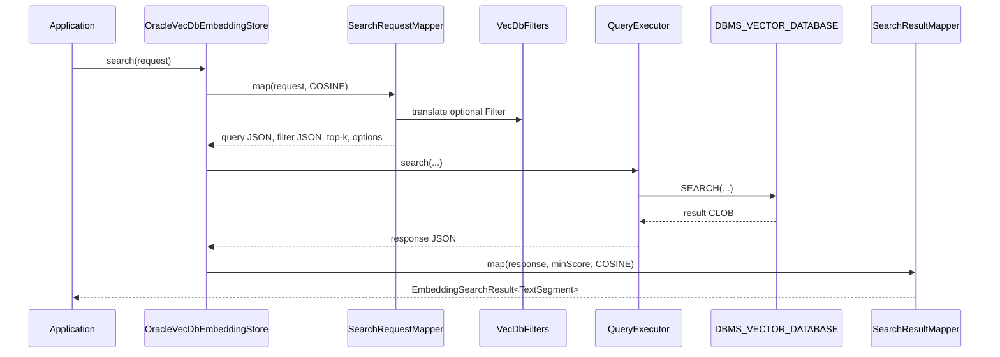

# Oracle VecDB Embedding Store Architecture and Implementation Plan

## 1. Project definition

This chapter establishes why the VecDB store is needed, the boundaries of the first delivery, and the principles that
will guide later design choices. Keeping these decisions together gives reviewers a single place to evaluate whether
the proposed work solves the intended LangChain4j use case without expanding into database-side embedding generation,
hidden backend selection, or unrelated changes to the established Oracle store.

### Document purpose

This specification defines the architecture, public APIs, database contracts, implementation phases, validation rules,
limitations, test strategy, and acceptance criteria for adding an Oracle VecDB-backed embedding store to the
`langchain4j-oracle` module.

The document is intended to be reviewed before the feature is proposed upstream. It uses normative language:

- **MUST** identifies a required contract or invariant.
- **SHOULD** identifies the preferred design unless a documented constraint requires another approach.
- **MAY** identifies an optional extension.

### Overview

The project will add a separate LangChain4j `EmbeddingStore<TextSegment>` backed by
`DBMS_VECTOR_DATABASE`. LangChain4j embedding models will generate dense vectors, while VecDB will own table storage,
indexing, similarity search, metadata filtering, and vector deletion.

The public entry point will be:

```java
dev.langchain4j.store.embedding.oracle.vecdb.OracleVecDbEmbeddingStore
```

This design deliberately differs from an environment-variable backend switch:

- `OracleEmbeddingStore` will continue to represent the existing Oracle vector-column store.
- `OracleVecDbEmbeddingStore` will represent VecDB.
- Applications will choose the concrete store explicitly in code.
- All VecDB types will live in the separate `dev.langchain4j.store.embedding.oracle.vecdb` package.

### Problem statement

LangChain4j defines a database-neutral embedding-store contract, while VecDB exposes package procedures whose inputs
and outputs are JSON. The integration must bridge four different models:

1. LangChain4j dense `Embedding` values.
2. LangChain4j `TextSegment` and flat `Metadata` values.
3. VecDB logical JSON records used by `UPSERT_VECTORS`, `SEARCH`, and related operations.
4. VecDB-managed physical tables, vector indexes, and metadata indexes.

The design must keep evolving PL/SQL signatures and JSON shapes away from the public store API. It must also preserve
LangChain4j behavior for generated IDs, upserts, metadata filters, score thresholds, and result reconstruction.

### Goals

- Add a dedicated `EmbeddingStore<TextSegment>` for Oracle VecDB.
- Preserve the existing Oracle embedding store and its public API.
- Use bring-your-own-vector ingestion as the first delivery model.
- Support generated IDs and caller-provided IDs.
- Support individual and batch vector upserts.
- Preserve `TextSegment.text()` and supported LangChain4j metadata values.
- Support dense-vector similarity search with maximum results and minimum score.
- Translate supported LangChain4j filters into constrained VecDB QBE JSON.
- Support IVF and HNSW vector-index configuration.
- Support metadata-index configuration and lifecycle.
- Support table creation, reuse, and replacement through the existing Oracle `CreateOption` enum.
- Support removal by ID, removal by multiple IDs, and removal of every row.
- Add a concrete-store API for describing the configured vector table.
- Require Oracle Database 23.26.3 or later.
- Isolate PL/SQL, Oracle JDBC types, and JSON shapes behind an executor and mapper layer.
- Keep store instances immutable and suitable for use with a thread-safe pooled `DataSource`.

### Non-goals for the first delivery

- Changing the LangChain4j `EmbeddingStore` interface.
- Replacing or internally switching `OracleEmbeddingStore`.
- Reading `USE_VECDB` or another environment variable.
- Database-side embedding generation.
- `CREATE_VECTOR_TABLE_FOR_MODEL` integration.
- Sparse-vector ingestion.
- Hybrid dense/sparse search.
- A third-party VecDB Java client.
- Nested metadata structures beyond the LangChain4j `Metadata` contract.
- Metadata-filter deletion until its consistency and pagination semantics are agreed with the team.
- General non-cosine score conversion.
- Full-text or substring filtering unless VecDB QBE can match LangChain4j `ContainsString` semantics exactly.

### Key design decisions

**Separate public store**

Applications will construct `OracleVecDbEmbeddingStore` directly. This makes backend choice visible, avoids hidden
environment-dependent behavior, and prevents VecDB-specific configuration from leaking into `OracleEmbeddingStore`.

**Bring-your-own vectors**

The integration will accept LangChain4j `Embedding` objects. Table creation will pass `embed_params => NULL`, and the
application will remain responsible for selecting and calling an embedding model.

**Client-generated IDs**

Table creation will set `table_params.auto_generate_id` to false. LangChain4j-generated UUIDs and caller-provided IDs
must remain stable and must be usable for upsert and removal.

**Cosine compatibility**

The first delivery will use cosine distance for index creation, search, and LangChain4j score conversion. A store build
must reject a vector index configured with another metric.

**Flat metadata only**

The integration will preserve LangChain4j's flat metadata model. A key such as `author.country` is one literal key in
LangChain4j; it will not be interpreted as JSON path `$.author.country`.

**Dedicated database boundary**

Store methods will not contain PL/SQL strings or Oracle JSON binding code. A small executor interface will own database
operations, and dedicated mappers will own request and response JSON.

### Requirements and dependencies

| Requirement | Planned baseline |
| --- | --- |
| Java | 17 |
| Oracle Database | 23.26.3 or later |
| Oracle JDBC | `com.oracle.database.jdbc:ojdbc8:23.5.0.24.07` |
| LangChain4j core | `dev.langchain4j:langchain4j-core:1.18.0-SNAPSHOT` |
| Oracle module | `dev.langchain4j:langchain4j-oracle:1.18.0-beta28-SNAPSHOT` |
| JSON | Existing Jackson Databind dependency |
| Database API | Direct calls to `DBMS_VECTOR_DATABASE` |

No new VecDB-specific production dependency is required. If Oracle later publishes an official supported Java client,
adoption should be evaluated separately against the executor boundary described here.

## 2. Contracts and compatibility

The integration sits between a stable Java abstraction and an evolving database package. This chapter defines which
side owns each behavior: LangChain4j owns IDs, embedded-object semantics, filters, and relevance scores, while VecDB
owns physical storage, package-level schema operations, index execution, and distance calculation. Making that division
explicit prevents database response details from becoming accidental public Java APIs.

### LangChain4j EmbeddingStore

The primary contract is:

```java
public final class OracleVecDbEmbeddingStore
        implements EmbeddingStore<TextSegment>
```

The store must honor these LangChain4j abstractions:

| Type | Contract used by VecDB integration |
| --- | --- |
| `Embedding` | Dense `float[]` generated by an embedding model |
| `TextSegment` | Non-blank text plus non-null metadata |
| `Metadata` | Flat keys; values are `String`, `UUID`, `Integer`, `Long`, `Float`, or `Double` |
| `EmbeddingSearchRequest` | Query embedding, maximum results, minimum score, optional filter |
| `EmbeddingSearchResult` | Ordered collection of matches |
| `EmbeddingMatch` | Score, ID, returned embedding, and reconstructed text segment |
| `Filter` | Metadata expression tree requiring database-specific translation |

### DBMS_VECTOR_DATABASE

The database contract will be expressed through these package functions:

| Capability | Package function |
| --- | --- |
| Discover tables | `LIST_VECTOR_TABLES` |
| Create table | `CREATE_VECTOR_TABLE` |
| Describe table | `DESCRIBE_VECTOR_TABLE` |
| Drop table | `DROP_VECTOR_TABLE` |
| Create indexes | `CREATE_INDEX` |
| Drop indexes | `DROP_INDEX` |
| Rebuild indexes | `REBUILD_INDEX` |
| Add or replace vectors | `UPSERT_VECTORS` |
| Page through vectors | `LIST_VECTORS` |
| Similarity search | `SEARCH` |
| Delete vectors | `DELETE_VECTORS` |

JSON property names and package signatures may change between VecDB package versions. Those details must remain inside
the JDBC executor and mapper classes.

### Existing OracleEmbeddingStore baseline

The VecDB design will follow user-facing conventions from the Oracle vector-column store without sharing its SQL table
implementation:

| Existing Oracle convention | VecDB design response |
| --- | --- |
| Builder requires `DataSource` and table configuration | Use the same builder style |
| `CreateOption` controls tables and indexes | Reuse the same enum and meanings |
| Generated IDs are UUID strings | Generate UUID strings in Java |
| Caller IDs perform upsert | Preserve caller-ID upsert behavior |
| Text and metadata round-trip into `TextSegment` | Reserve metadata key `text` until content retrieval is available |
| Search uses cosine by default | Fix first VecDB delivery to cosine |
| Cosine distance is converted to relevance | Use `1 - distance / 2` |
| Minimum score is applied locally | Apply the same local threshold policy |
| Metadata filters require database translation | Translate LangChain4j filters into VecDB QBE rather than SQL |
| Exact search can be selected in the SQL store | Treat exact-search selection as a later VecDB capability |

The two stores will differ at the persistence boundary. `OracleEmbeddingStore` owns configurable SQL columns and SQL
predicates; `OracleVecDbEmbeddingStore` will own logical VecDB records and package calls. VecDB users will not configure
physical column names because `DBMS_VECTOR_DATABASE` manages the table shape.

## 3. Architecture and component boundaries

The architecture is organized around a narrow public facade and several internal boundaries with one responsibility
each. The store coordinates LangChain4j operations, configuration objects describe intent, mappers translate structured
data, and the executor contains every Oracle-specific call. This separation is especially important for VecDB because
its PL/SQL signatures and JSON documents may evolve independently of the LangChain4j contract.

### Package and class layout

**Public application-facing types**

| Type | Purpose |
| --- | --- |
| `OracleVecDbEmbeddingStore` | Main LangChain4j store and builder |
| `OracleVecDbEmbeddingStore.VectorTableDescription` | Reduced table-description result |
| `VecDbEmbeddingTable` | Table name, comment, annotations, and lifecycle |
| `VecDbVectorIndex` | Immutable IVF or HNSW index configuration |
| `VecDbIvfIndexBuilder` | IVF-specific configuration |
| `VecDbHnswIndexBuilder` | HNSW-specific configuration |
| `VecDbMetadataIndex` | Metadata indexing and lifecycle |
| `VecDbDistributeParameters` | Distributed HNSW settings |
| `VecDbDistanceMetric` | VecDB distance metric names |
| `VecDbIndexOrganization` | IVF or HNSW organization |
| `VecDbQuantizationType` | Quantization mode |
| `VecDbQuantizationAlgorithm` | Advanced quantization algorithm |

**Internal types**

| Type | Purpose |
| --- | --- |
| `VecDbSchemaManager` | Coordinates version, table, and index preparation |
| `VecDbQueryExecutor` | Database-operation port used by the store and schema manager |
| `VecDbJdbcQueryExecutor` | JDBC and PL/SQL adapter |
| `VecDbEmbeddingTableJsonMapper` | Table parameter, annotation, and description JSON |
| `VecDbIndexJsonMapper` | Root vector/metadata index JSON |
| `VecDbVectorJsonMapper` | Upsert records and ID arrays |
| `VecDbSearchRequestMapper` | Search request parameters |
| `VecDbSearchResultMapper` | Search results and LangChain4j matches |
| `VecDbFilters` | Constrained QBE filter translation |
| `VecDbSupport` | Database version parsing and gating |
| `VecDbIndexBuilder` | Shared vector-index builder validation |

Internal types should be package-private unless a specific extension or testing requirement justifies public exposure.

### Runtime architecture



**Architectural patterns**

- **Adapter/facade:** the store adapts LangChain4j operations to VecDB.
- **Builder:** immutable table, vector-index, metadata-index, and store configurations.
- **Coordinator:** the schema manager owns lifecycle decisions rather than SQL or JSON serialization.
- **Port and adapter:** the executor interface is the test seam; the JDBC class is the Oracle adapter.
- **Boundary mappers:** each JSON contract has one owner.
- **Translator registry:** filter classes map to operator rules without one large `instanceof` chain.
- **Translation context:** negation state moves through the filter tree and applies De Morgan transformations.

**Build sequence**



Store construction intentionally prepares the schema eagerly so configuration and version errors fail before the first
ingestion or search request.

**JSON ownership matrix**

| JSON document | Owner | Consumer |
| --- | --- | --- |
| `table_params` | `VecDbEmbeddingTableJsonMapper` | `CREATE_VECTOR_TABLE` |
| table annotations | `VecDbEmbeddingTableJsonMapper` | `CREATE_VECTOR_TABLE` |
| root `index_params` | `VecDbIndexJsonMapper` | Table and index package calls |
| `vectors` records | `VecDbVectorJsonMapper` | `UPSERT_VECTORS` |
| ID arrays | `VecDbVectorJsonMapper` | `LIST_VECTORS`, `DELETE_VECTORS` |
| `query_by` | `VecDbSearchRequestMapper` | `SEARCH` |
| `advanced_options` | `VecDbSearchRequestMapper` | `SEARCH` |
| `filters` | `VecDbFilters` | `SEARCH` |
| search `results` | `VecDbSearchResultMapper` | `EmbeddingSearchResult` |
| reduced table description | `VecDbEmbeddingTableJsonMapper` | `VectorTableDescription` |

No JSON document should be assembled in the public store with string concatenation. Mappers should use Jackson object
and array nodes so numbers, strings, UUIDs, and escaping remain type-safe.

## 4. Public API, data model, and store contracts

The public API should feel familiar to users of the Oracle module while making VecDB-specific capabilities explicit.
The builder expresses table and index intent before construction, and the store methods continue to follow the
`EmbeddingStore<TextSegment>` contract. The data model then explains how those Java objects become logical VecDB
records and, ultimately, columns in the managed table.

### Public API design

**Minimal existing-table usage**

```java
OracleVecDbEmbeddingStore store = OracleVecDbEmbeddingStore.builder()
        .dataSource(dataSource)
        .embeddingTable("MY_VECTORS")
        .build();
```

This overload means `CreateOption.CREATE_NONE`; the table must already exist.

**Table creation**

```java
VecDbEmbeddingTable table = VecDbEmbeddingTable.builder()
        .name("MY_VECTORS")
        .comment("LangChain4j text embeddings")
        .annotation("application", "knowledge-search")
        .createOption(CreateOption.CREATE_IF_NOT_EXISTS)
        .build();
```

**Index configuration during store construction**

```java
VecDbVectorIndex vectorIndex = VecDbVectorIndex.hnswIndexBuilder()
        .accuracy(90)
        .neighbors(32)
        .efConstruction(200)
        .createOption(CreateOption.CREATE_IF_NOT_EXISTS)
        .build();

VecDbMetadataIndex metadataIndex = VecDbMetadataIndex.builder()
        .autoIndex(true)
        .createOption(CreateOption.CREATE_IF_NOT_EXISTS)
        .build();

OracleVecDbEmbeddingStore store = OracleVecDbEmbeddingStore.builder()
        .dataSource(dataSource)
        .embeddingTable(table)
        .index(vectorIndex)
        .metadataIndex(metadataIndex)
        .parallelCreation(4)
        .build();
```

**Store builder contract**

| Builder method | Required | Meaning |
| --- | --- | --- |
| `dataSource(DataSource)` | Yes | Supplies JDBC connections |
| `embeddingTable(String)` | One table overload required | Reuses an existing table |
| `embeddingTable(String, CreateOption)` | One table overload required | Configures name and lifecycle |
| `embeddingTable(VecDbEmbeddingTable)` | One table overload required | Full table model |
| `index(VecDbVectorIndex)` | No | Vector index and lifecycle |
| `metadataIndex(VecDbMetadataIndex)` | No | Metadata index and lifecycle |
| `parallelCreation(int)` | No | Root index creation parallelism; must be positive |
| `build()` | Yes | Validates configuration and prepares schema |

The overloads share a name because they configure the same property at different detail levels. The string overload is
convenient; the object overload exposes the full table contract.

**VecDB-specific table description**

```java
OracleVecDbEmbeddingStore.VectorTableDescription description =
        store.describeVectorTable();
```

The result will expose only:

- `tableName`
- `comment`
- `annotations`

This method is intentionally outside `EmbeddingStore`. A caller that needs it must retain the concrete
`OracleVecDbEmbeddingStore` type rather than storing the reference only as `EmbeddingStore<TextSegment>`.

### Data model

**VecDB physical table**

The target VecDB package creates a table shaped like this:

| Column | Type | LangChain4j mapping |
| --- | --- | --- |
| `ID` | `VARCHAR2(40) NOT NULL` | Generated UUID or caller-provided ID |
| `DENSE_VECTOR` | `VECTOR(*,*,DENSE)` | `Embedding.vector()` |
| `CONTENT_METADATA` | `JSON` | User metadata and compatibility text field |
| `SPARSE_VECTOR` | `VECTOR(*,*,SPARSE)` | Outside first-delivery scope |
| `CONTENT` | `BLOB` | Text content, subject to VecDB upsert encoding validation |
| `CONTENT_TYPE` | `VARCHAR2(256)` | MIME type for `CONTENT` |

The VecDB package uses logical JSON property `metadata`; the database maps it to physical column `CONTENT_METADATA`.

**Table creation parameters**

The table mapper will produce:

```json
{"auto_generate_id":false}
```

Table creation will call `CREATE_VECTOR_TABLE` with:

- table name
- optional comment
- optional annotations JSON
- `table_params.auto_generate_id = false`
- `embed_params = NULL`
- optional `index_params`

**Vector-only record**

```json
{
  "id": "generated-or-caller-id",
  "dense_vector": [0.1, 0.2, 0.3]
}
```

No text or metadata exists for the vector-only overloads.

**TextSegment record**

The compatibility payload will preserve text under reserved metadata key `text` so a search response can reconstruct a
LangChain4j `TextSegment`:

```json
{
  "id": "generated-or-caller-id",
  "dense_vector": [0.1, 0.2, 0.3],
  "metadata": {
    "tenant": "acme",
    "text": "Oracle vector search"
  }
}
```

The key `text` is reserved by the store. User metadata containing this key must be rejected to prevent ambiguous
round-trip behavior.

**CONTENT BLOB decision checkpoint**

The target design should store the same segment text in `CONTENT` and set `CONTENT_TYPE` to a UTF-8 text MIME type. The
preferred single-operation payload is provisionally:

```json
{
  "id": "generated-or-caller-id",
  "dense_vector": [0.1, 0.2, 0.3],
  "metadata": {
    "tenant": "acme",
    "text": "Oracle vector search"
  },
  "content": "Oracle vector search",
  "content_type": "text/plain; charset=UTF-8"
}
```

Before this becomes part of the store contract, an integration spike MUST verify whether `UPSERT_VECTORS` expects:

1. plain JSON text that the package converts to BLOB,
2. Base64-encoded bytes,
3. another structured property, or
4. a separate package operation.

If the package cannot write content, a direct JDBC BLOB update may be considered. That fallback introduces identifier
validation, UTF-8 conversion, transaction boundaries, partial-failure behavior, and possible loss of atomicity between
the vector upsert and content update. It should not be selected without a documented transaction design.

### EmbeddingStore operation contracts

**Add and upsert**

| Method | ID behavior | Stored values | Return |
| --- | --- | --- | --- |
| `add(Embedding)` | Generate UUID | ID and dense vector | Generated ID |
| `add(String, Embedding)` | Use caller ID | ID and dense vector | `void` |
| `add(Embedding, TextSegment)` | Generate UUID | ID, vector, text, metadata, and content when the BLOB contract is confirmed | Generated ID |
| `addAll(List<Embedding>)` | Generate ordered UUID list | One array of vector-only records | Ordered IDs |
| `addAll(List<Embedding>, List<TextSegment>)` | LangChain4j default generates IDs | One array of complete records | Ordered IDs |
| `addAll(List<String>, List<Embedding>, List<TextSegment>)` | Use caller IDs | One array of complete records | `void` |

Caller-provided IDs provide upsert semantics. The implementation must validate non-blank IDs, equal list sizes, and
non-null list entries before calling the database. A later refinement should validate the physical 40-character limit
before JDBC execution.

**Search**

```java
EmbeddingSearchResult<TextSegment> search(EmbeddingSearchRequest request)
```

The operation must map the dense query vector, top-k, supported metadata filter, and cosine search options into one
`SEARCH` call. Result order must match VecDB order. Minimum score will be enforced after distance-to-score conversion.

**Removal**

| Method | Planned behavior |
| --- | --- |
| `remove(String)` | Use the LangChain4j default and delegate to one-ID removal |
| `removeAll(Collection<String>)` | Call `DELETE_VECTORS` with a JSON ID array |
| `removeAll()` | Repeatedly list and delete ID batches while preserving table and indexes |
| `removeAll(Filter)` | Defer until team agreement on search/delete consistency and pagination |

**Describe table**

The concrete API will call `DESCRIBE_VECTOR_TABLE`, accept `comment` or compatibility field `description`, and return
an immutable annotations map. Unrelated package response fields will remain internal.

## 5. Schema and index management

Schema preparation translates declarative builder configuration into a deterministic sequence of VecDB operations.
Table lifecycle and index lifecycle are related but deliberately independent: reusing a table does not imply that its
indexes should be replaced, and replacing a metadata index should not disturb a vector index. The decision tables in
this chapter are therefore part of the observable builder contract, not merely internal control flow.

### Schema preparation

**Ownership**

`VecDbSchemaManager` will own lifecycle decisions. It will not own or close the connection supplied by the store.
`VecDbQueryExecutor` will own individual package calls.

**Table lifecycle**

| Table option | Table missing | Table present |
| --- | --- | --- |
| `CREATE_NONE` | Fail fast | Reuse table and process separately configured index lifecycles |
| `CREATE_IF_NOT_EXISTS` | Create table | Reuse table and process index lifecycles |
| `CREATE_OR_REPLACE` | Create table | Drop table and its data, then create replacement |

The database-version check must occur before any VecDB schema operation.

**Existing vector-index lifecycle**

| Vector index option | Index missing | Index present |
| --- | --- | --- |
| `CREATE_NONE` | No action | No action |
| `CREATE_IF_NOT_EXISTS` | `CREATE_INDEX` | No action |
| `CREATE_OR_REPLACE` | `CREATE_INDEX` | `REBUILD_INDEX` |

**Existing metadata-index lifecycle**

| Metadata index option | Index missing | Index present |
| --- | --- | --- |
| `CREATE_NONE` | No action | No action |
| `CREATE_IF_NOT_EXISTS` | `CREATE_INDEX` | No action |
| `CREATE_OR_REPLACE` | `CREATE_INDEX` | Drop metadata indexes, then `CREATE_INDEX` |

**Index-state discovery**

The executor will inspect `DESCRIBE_VECTOR_TABLE`. It may use returned index type/name fields and then fall back to
`index_params.auto_index` or configured metadata paths. This compatibility logic belongs in the JDBC adapter because
description response shapes are package-version dependent.

An existing table should eventually be validated for required columns and compatible vector capabilities, not only for
name existence.

### Vector index design

**Root index parameters**

Vector index, metadata index, and creation parallelism will be combined at schema-preparation time:

```json
{
  "vector_index_params": {},
  "metadata_index_params": {},
  "parallel_creation": 4
}
```

`parallel_creation` is a root `index_params` field and must be positive.

If all three builder inputs are absent, `index_params` will be null and VecDB may apply its package defaults. Passing an
index configuration with `CREATE_NONE` is different: its section will be present with `auto_index` set to false.

A configured HNSW and metadata-index example will map to a document of this form:

```json
{
  "vector_index_params": {
    "auto_index": true,
    "organization": "INMEMORY GRAPH",
    "distance_metric": "COSINE",
    "accuracy": 90,
    "advanced_params": {
      "neighbors": 32,
      "efConstruction": 200
    }
  },
  "metadata_index_params": {
    "auto_index": true
  },
  "parallel_creation": 4
}
```

`CreateOption` itself is not sent as an enum name. The schema manager uses it to choose package operations, and the
mapper uses it when deriving `auto_index`.

**Common vector-index parameters**

| Builder property | JSON property | Validation/default |
| --- | --- | --- |
| `distanceMetric` | `distance_metric` | Defaults to `COSINE`; store accepts cosine only |
| `accuracy` | `accuracy` | 0 through 100 |
| `quantizationType` | `quantization_type` | `NONE` or `SCALAR` |
| `compressionRatio` | `compression_ratio` | 2, 4, or 8; scalar quantization required |
| `onlineBuild` | `online_build` | Optional boolean |
| `createOption` | Controls `auto_index` and lifecycle | Defaults to `CREATE_NONE` |

**IVF**

```java
VecDbVectorIndex.ivfIndexBuilder()
```

IVF maps to organization `PARTITIONS` and adds:

| Property | JSON location | Validation |
| --- | --- | --- |
| `partitions` | `advanced_params.partitions` | 1 through 10,000,000 |

**HNSW**

```java
VecDbVectorIndex.hnswIndexBuilder()
```

HNSW maps to organization `INMEMORY GRAPH` and adds:

| Property | JSON location | Validation |
| --- | --- | --- |
| `neighbors` | `advanced_params.neighbors` | 1 through 2,048 |
| `efConstruction` | `advanced_params.efConstruction` | 1 through 65,535 |
| `rescoreFactor` | `advanced_params.rescore_factor` | 1 through 100 |
| `quantizationAlgorithm` | `advanced_params.algorithm` | Scalar quantization required |
| `distributeParameters` | `distribute_params` | Method, service, or both |

`VecDbDistributeParameters` must reject a configuration where both distribution method and service name are absent.

**Distance metric invariant**

The distance function recommended by the embedding model should be used consistently for index creation and search.
For first-delivery compatibility with `OracleEmbeddingStore` and LangChain4j score semantics, the store will fix this to
cosine.

Using a search metric different from the vector index metric prevents Oracle from using that index and can trigger an
exact search. The store-level validation avoids that accidental mismatch.

### Metadata index design

`VecDbMetadataIndex` will configure:

| Property | Meaning |
| --- | --- |
| `autoIndex` | Whether VecDB discovers and maintains qualifying metadata paths automatically |
| `includePaths` | Metadata paths explicitly eligible for indexing |
| `excludePaths` | Metadata paths excluded from indexing |
| `createOption` | Existing index lifecycle |

`autoIndex` and `CreateOption` are independent concepts:

- `CreateOption` decides whether schema preparation creates, reuses, or replaces an index.
- `autoIndex` decides how VecDB discovers metadata paths for the requested metadata index.

Paths will be passed to VecDB verbatim after non-blank validation. `includePaths` and `excludePaths` must not both contain
wildcard `*`.

Because `metadata.text` contains full segment text but is reserved and not filterable, the team should decide whether
automatic metadata indexing must exclude it. Explicit path configuration should prefer business metadata keys rather
than the compatibility text field.

## 6. Search, filtering, and removal behavior

Search is the point where LangChain4j semantics and VecDB semantics interact most directly. A query must preserve
database ordering and filtering while returning LangChain4j scores and reconstructed `TextSegment` objects. Removal is
grouped here because filter-based deletion would reuse the same metadata predicate model and raises related questions
about pagination, consistency, and concurrent changes.

### Search architecture

**Request flow**



**Request mapping**

| LangChain4j input | VecDB input |
| --- | --- |
| `queryEmbedding()` | `query_by = {"vector":[...]}` |
| `maxResults()` | `top_k` |
| `filter()` | QBE `filters` JSON or null |
| Store metric | `advanced_options.distance_metric = COSINE` |
| Result reconstruction requirement | `include_vectors = TRUE` |

`EmbeddingSearchRequest.query()` will remain outside first-delivery scope. The mapper will use only the required query
embedding.

**Result mapping**

The mapper will require a root `results` array. Each result will be interpreted from:

- `id`: non-blank embedding ID
- `distance`: finite cosine distance
- `vector`: optional returned dense vector
- `metadata`: optional object containing reserved text and user metadata

The reserved `text` property will be removed from metadata before constructing the returned `Metadata`. Missing text
will result in a null embedded object rather than a fabricated segment.

**Score conversion**

Oracle cosine distance is expected in `[0, 2]`; LangChain4j relevance is expected in `[0, 1]`:

```text
score = 1 - (distance / 2)
```

The mapper will reject distance outside the cosine range. `minScore` will be applied locally after VecDB returns its
top-k rows. Consequently, the final result count may be lower than `maxResults`.

**First-delivery search limits**

- Cosine only.
- Dense vector query only.
- No exact-search toggle.
- No text or hybrid query.
- No sparse query.
- No output selector API.
- Vectors requested for every result.
- No over-fetch to compensate for local minimum-score filtering.

### Metadata filter architecture

**Why translation is separate**

LangChain4j `Filter` objects express in-memory metadata predicates. VecDB expects QBE JSON. The integration can reuse
the LangChain4j input type, but it must own a separate translator because operator names, missing-field behavior,
supported values, and path rules are database-specific.

**Translator design**

`VecDbFilters` will use:

- a registry keyed by exact LangChain4j filter class,
- a functional translator per filter type,
- a `FilterRule` describing normal and negated operators,
- an `OperandKind` describing scalar, ordered, or collection validation,
- a `TranslationContext` carrying whether the current expression is negated.

The context allows `Not` to invert comparison operators and apply De Morgan's law without building a second Java
expression tree.

**Operator mapping**

| LangChain4j filter | Normal QBE operator | Under `Not` |
| --- | --- | --- |
| `IsEqualTo` | `$eq` | `$ne` |
| `IsNotEqualTo` | `$ne` | `$eq` |
| `IsGreaterThan` | `$gt` | `$lte` plus missing-field branch |
| `IsGreaterThanOrEqualTo` | `$gte` | `$lt` plus missing-field branch |
| `IsLessThan` | `$lt` | `$gte` plus missing-field branch |
| `IsLessThanOrEqualTo` | `$lte` | `$gt` plus missing-field branch |
| `IsIn` | `$in` | `$nin` |
| `IsNotIn` | `$nin` | `$in` |
| `And` | `$and` | `$or` with negated operands |
| `Or` | `$or` | `$and` with negated operands |

Example equality:

```java
Filter filter = metadataKey("tenant").isEqualTo("acme");
```

```json
{"tenant":{"$eq":"acme"}}
```

Example `NOT(age > 18)`:

```json
{
  "$or": [
    {"age":{"$lte":18}},
    {"age":{"$exists":false}}
  ]
}
```

The missing-field branch is necessary because LangChain4j comparison returns false when a key is absent, so negating
that comparison returns true.

**Filter constraints**

- Scalar values: `String`, `UUID`, `Integer`, `Long`, finite `Float`, finite `Double`.
- Ordered operators: strings and numbers only.
- Collection operators: non-empty collections of supported scalar values.
- UUID values: normalized to strings.
- Null, Boolean, arbitrary object, and non-finite numeric operands: rejected.
- Key `text`: rejected because it is store-owned compatibility metadata.
- Keys beginning with `$`: rejected to prevent QBE operator injection.
- Keys containing `.`, `[`, `]`, or backticks: rejected to prevent nested-path or QBE-path interpretation.
- Nested filters: logical nesting is supported; nested JSON metadata paths are not.
- `ContainsString`: deferred until equivalent VecDB semantics, escaping, and case sensitivity are verified.

Unsupported filter forms should throw `UnsupportedFeatureException` with the exact unsupported type, key, or value.

### Removal design

**ID deletion**

IDs will be serialized as a JSON array and passed to `DELETE_VECTORS`. Empty collections must be rejected consistently
with the store's validation policy.

**Remove all**

Dropping and recreating the table would destroy schema metadata and indexes. The preferred algorithm is:

1. Call `LIST_VECTORS` with offset zero and a fixed batch limit, initially 1,000.
2. Parse IDs from `items`.
3. Stop when the list is empty.
4. Delete the returned IDs with `DELETE_VECTORS`.
5. Repeat from offset zero because the remaining rows shift after deletion.

**Filter deletion decision**

A search-then-delete approach is technically possible but needs an explicit contract for:

- paging beyond search top-k,
- changes made concurrently between search and delete,
- duplicate or skipped IDs during paging,
- maximum deletion workload,
- partial failure and retry behavior,
- whether filter search must return rows without a meaningful query vector.

The method will remain a documented decision point until the team accepts those semantics.

## 7. Database integration and operational model

The database boundary must be small enough to test without Oracle while still exposing every package capability needed
by the store. It also defines operational behavior that application code depends on indirectly: connection ownership,
resource cleanup, version checks, transaction expectations, exception categories, and protection against injection.
Keeping these rules together makes it possible to review the integration as a database client rather than only as a set
of embedding-store methods.

### Executor and JDBC design

**Executor contract**

```java
interface VecDbQueryExecutor {
    boolean vectorTableExists(Connection connection, String tableName);
    String createVectorTable(...);
    String describeVectorTable(...);
    String dropVectorTable(...);
    IndexStatus indexStatus(...);
    String createIndex(...);
    String dropIndex(...);
    String rebuildIndex(...);
    String upsertVectors(...);
    String listVectors(...);
    String search(...);
    String deleteVectors(...);
}
```

The interface will stay package-private. Unit tests in the same package can provide a fake executor without connecting to
Oracle Database.

**CallableStatement pattern**

Every package function returns a CLOB. The shared JDBC call method will:

1. Prepare a PL/SQL block.
2. Register output parameter 1 as `OracleTypes.CLOB`.
3. Run operation-specific `StatementBinder` callbacks.
4. Execute the statement.
5. Read the CLOB through a character stream.
6. Free the CLOB and close the statement.

`StatementBinder` is a small functional interface that removes repetitive parameter-binding code while allowing each
operation to capture its own Java values.

**JSON binding**

JSON parameters will be bound as `OracleType.JSON` using `OracleJsonFactory`. Optional null JSON parameters must be
bound as typed JSON nulls rather than untyped SQL nulls.

**Resource ownership**

- The store owns connections obtained from its `DataSource`.
- The store closes each connection using try-with-resources.
- The executor owns statements, response readers, and returned CLOB cleanup.
- The schema manager borrows a connection and must not close it.

**Package parameter mapping**

| Function | Bound inputs | Returned value |
| --- | --- | --- |
| `LIST_VECTOR_TABLES` | None | CLOB containing vector table descriptions |
| `CREATE_VECTOR_TABLE` | `name`, `comment`, `annotations`, `table_params`, `embed_params = NULL`, `index_params` | Status/description CLOB |
| `DESCRIBE_VECTOR_TABLE` | `name` | Description CLOB |
| `DROP_VECTOR_TABLE` | `name` | Status CLOB |
| `CREATE_INDEX` | `table_name`, `index_params` | Status CLOB |
| `DROP_INDEX` | `table_name`, `index_params` | Status CLOB |
| `REBUILD_INDEX` | `table_name`, `index_params` | Status CLOB |
| `UPSERT_VECTORS` | `table_name`, `vectors` | Upsert status CLOB |
| `LIST_VECTORS` | `table_name`, optional `ids`, `limit`, `offset` | Paged vector CLOB |
| `SEARCH` | `table_name`, `query_by`, optional `filters`, `top_k`, `include_vectors`, `advanced_options` | Search result CLOB |
| `DELETE_VECTORS` | `table_name`, `ids` | Delete status CLOB |

The first JDBC signature should omit optional debug flags, output selectors, and request IDs unless the public API has a
clear requirement for them. Named PL/SQL parameters reduce coupling to argument position, while JDBC bind variables keep
values out of the PL/SQL source text.

### Version capability gate

VecDB operations require Oracle Database 23.26.3 or later.

The version utility will:

1. Read `DatabaseMetaData.getDatabaseProductVersion()`.
2. Search for three-component numeric versions such as `23.26.3`.
3. Use the last matching full version because Oracle product strings may contain both release and full-version values.
4. Compare major, minor, then patch numerically.
5. Reject an unsupported version with `UnsupportedFeatureException`.
6. Reject an unparseable product string with `IllegalStateException`.

The gate will run only when constructing the VecDB store. It will not affect `OracleEmbeddingStore`.

### Validation and error model

**Builder validation**

- `DataSource` is required.
- An embedding table configuration is required.
- Table names and comments, when supplied, must be non-blank.
- Annotation names must be non-blank and values non-null.
- Parallel creation must be greater than zero.
- Store-attached vector indexes must use cosine.

**Ingestion validation**

- Embeddings, segments, and IDs must be non-null.
- IDs must be non-blank.
- Batch lists must have equal sizes.
- Every batch element must be non-null.
- User metadata must not use reserved key `text`.
- Empty embedding batches should return an empty ID list without a database call.
- Empty deletion ID collections should fail validation.

**Index validation**

- Accuracy must be between 0 and 100.
- Scalar quantization requires compression ratio.
- Compression ratio requires scalar quantization and must be 2, 4, or 8.
- Advanced quantization algorithm requires scalar quantization.
- IVF partitions must be between 1 and 10,000,000.
- HNSW neighbors must be between 1 and 2,048.
- HNSW `efConstruction` must be between 1 and 65,535.
- HNSW rescore factor must be between 1 and 100.
- Distributed HNSW configuration must contain at least one value.

**Error categories**

| Category | Exception direction |
| --- | --- |
| Invalid user configuration | `IllegalArgumentException` or validation utility exception |
| Unsupported database version or feature | `UnsupportedFeatureException` |
| Missing required existing table | `IllegalStateException` |
| Malformed VecDB response | `IllegalStateException` at mapper boundary |
| JDBC/package failure | Runtime wrapper retaining the original `SQLException` cause |

A later API review should decide whether generic JDBC runtime wrapping should be replaced by a module-specific exception.

### Concurrency and transaction model

- Store configuration objects will be immutable after construction.
- The store may be shared between threads when the configured `DataSource` is thread-safe.
- A pooled `DataSource` is strongly recommended because each operation obtains a connection.
- The store will not cache a JDBC connection.
- Transaction behavior is controlled by the VecDB package and connection configuration unless the API explicitly
  documents an automatic commit.
- `DELETE_VECTORS` must be treated as auto-committing when the package version documents that behavior.
- Any fallback involving a separate BLOB update must define how partial vector/content writes are detected and repaired.

### Security considerations

- All operation values must use JDBC bind parameters.
- Table names are passed as package string parameters, not concatenated into SQL text.
- Filter keys beginning with `$` or containing QBE/nested path syntax must be rejected.
- Metadata values must be serialized through Jackson rather than concatenated into JSON strings.
- Package response JSON must be validated before use.
- Direct SQL against a physical table, if required for BLOB content, must use a validated Oracle identifier strategy.
- Error messages should retain enough context for diagnosis without logging full embeddings or sensitive metadata.

## 8. Constraints, risks, and unresolved design questions

The first delivery intentionally narrows several capabilities so that the public contract remains predictable. These
constraints are not merely missing conveniences: each one represents a place where VecDB package behavior, LangChain4j
semantics, or operational cost needs stronger evidence. Recording the risks now prevents provisional assumptions from
quietly becoming compatibility promises.

### Package documentation drift

VecDB PL/SQL signatures and JSON fields are evolving. The physical table now exposes `CONTENT`, `CONTENT_TYPE`, and
`SPARSE_VECTOR`, while public upsert examples may still show only ID, dense vector, and metadata. Integration tests must
target the exact database package version used for release.

### BLOB content ambiguity

The encoding accepted by `UPSERT_VECTORS` for `CONTENT BLOB` must be proven. Guessing the JSON shape risks silent null
content, rejected requests, or corrupted text.

### Metric surface broader than store support

The distance enum may represent more VecDB values than the first store release can score. Public documentation must
state that store construction accepts cosine only until metric-specific LangChain4j score conversions are designed.

### Existing-table compatibility

Table discovery by name does not prove that required columns, vector type, ID width, or index metadata are compatible.
A describe-and-validate step should be considered before production readiness.

### Index-state heuristics

Index discovery may rely on names, types, or stored parameters returned by `DESCRIBE_VECTOR_TABLE`. That logic needs
fixture tests for every supported response shape.

### Large operations

- Batch upsert needs a payload-size and chunking policy.
- Remove-all needs repeated database calls.
- Filter deletion may need unbounded paging.
- Search minimum score is local and may reduce the result count below requested top-k.

### Metadata text duplication

Storing text in both metadata and content simplifies LangChain4j reconstruction but consumes additional storage and may
cause automatic metadata indexing to consider a large reserved string. A future search output capable of returning
content could allow removal of the compatibility metadata copy, but that would require migration and compatibility
planning.

## 9. Delivery plan and quality gates

The work is divided into small phases so each architectural boundary can be reviewed and understood before the next
one depends on it. Every phase has exit criteria that describe observable evidence, not simply source files. This keeps
the development process aligned with the project's step-by-step learning goal and makes regressions easier to locate.

The work should proceed in small reviewable phases. Each phase should compile before the next begins.

### Phase 1: Configuration model

Deliverables:

- Separate `oracle.vecdb` package.
- `VecDbEmbeddingTable`.
- IVF and HNSW index builders.
- Metadata index builder.
- Distance, organization, and quantization enums.
- Validation of builder invariants.

Exit criteria:

- Public builder examples compile.
- Configuration objects are immutable.
- JSON-independent validation is covered by unit tests.

### Phase 2: Executor boundary

Deliverables:

- Package-private `VecDbQueryExecutor`.
- JDBC adapter using `CallableStatement`.
- Oracle JSON binding helper.
- CLOB response reader.
- Fake executor pattern for tests.

Exit criteria:

- PL/SQL strings exist only in the JDBC adapter.
- Null and non-null JSON binding are verified.
- CLOB cleanup is deterministic.

### Phase 3: Table and schema preparation

Deliverables:

- Table parameter and annotation mapper.
- Database 23.26.3 version gate.
- Table existence discovery.
- Table `CreateOption` decision logic.
- Reduced table description API.

Exit criteria:

- Every table lifecycle branch is unit-tested through a fake executor.
- Version strings with release and full version values are covered.
- `CREATE_OR_REPLACE` is clearly documented as destructive.

### Phase 4: Index preparation

Deliverables:

- Root index JSON mapper.
- IVF and HNSW parameter mapping.
- Metadata index mapping.
- Parallel creation mapping.
- Existing index discovery and lifecycle actions.

Exit criteria:

- Vector and metadata index lifecycles are independently testable.
- Null configuration and `CREATE_NONE` produce distinct documented JSON.
- Cosine validation prevents store/index mismatch.

### Phase 5: Dense ingestion

Deliverables:

- ID and vector JSON mapper.
- Text and metadata mapping with reserved `text` key.
- Single and batch store methods.
- UUID generation and caller-ID upsert.

Exit criteria:

- All list-size and null validations are covered.
- Generated IDs preserve input order.
- Metadata types round-trip through VecDB JSON.

### Phase 6: Content BLOB spike

Deliverables:

- Direct PL/SQL proof for `content` and `content_type` input.
- Query verifying `DBMS_LOB.GETLENGTH(CONTENT)` and UTF-8 decoding.
- Decision record for plain text, Base64, package operation, or JDBC fallback.
- Final ingestion mapping and transaction policy.

Exit criteria:

- Newly inserted text appears in both `CONTENT_METADATA.text` and `CONTENT`.
- `CONTENT_TYPE` is populated consistently.
- Non-ASCII text round-trips correctly.

### Phase 7: Search and result mapping

Deliverables:

- Search request mapper.
- Cosine advanced options.
- Search result mapper.
- Score conversion and local minimum score.
- TextSegment reconstruction.

Exit criteria:

- Stored vector finds itself as the nearest result.
- Result order matches VecDB.
- Score range and malformed responses are covered.

### Phase 8: Metadata filters

Deliverables:

- Registry-based QBE translators.
- Logical nesting and negation context.
- Operand and key constraints.
- Missing-field behavior for negated ordered comparisons.

Exit criteria:

- Database results match `Filter.test(Metadata)` for supported filters.
- Unsupported cases fail before JDBC execution.
- Nested logical expressions are covered.

### Phase 9: Removal

Deliverables:

- One-ID and many-ID deletion.
- List-and-delete remove-all loop.
- Team decision document for filter deletion.

Exit criteria:

- ID deletion preserves table and indexes.
- Remove-all terminates for empty and multi-batch tables.
- Package commit behavior is documented.

### Phase 10: Hardening and upstream preparation

Deliverables:

- Unit-test suite.
- VecDB integration-test profile.
- Public Javadocs and usage documentation.
- Compatibility review against the target package release.
- API visibility and experimental-status review.

Exit criteria:

- Module build and formatting checks pass.
- No live database is required for unit tests.
- Integration tests cover the exact supported database version.
- All open decisions are closed or explicitly deferred.

### Verification strategy

Testing is split between deterministic unit tests and database integration tests. Unit tests protect translation and
lifecycle decisions without requiring Oracle, while integration tests prove assumptions that only the target VecDB
package can answer, especially JSON response shapes, index behavior, automatic commits, and BLOB encoding.

**Unit tests without Oracle Database**

- Store delegation through a fake executor.
- Generated ID count and ordering.
- Vector-only and complete upsert JSON.
- Content payload after its encoding contract is confirmed.
- Batch validation and reserved metadata key.
- Table annotation and description mapping.
- IVF, HNSW, metadata, and root index JSON.
- Every table and index lifecycle branch.
- Every supported filter and negation rule.
- Unsupported key, type, collection, and `ContainsString` behavior.
- Search distance validation, score conversion, threshold, vector parsing, and metadata reconstruction.
- Version parsing and minimum-version comparison.
- Invalid and missing response fields.

**Integration tests**

- Connect to Oracle Database 23.26.3 or later.
- Reject an older reported database version.
- Create, reuse, and replace a VecDB table.
- Describe table name, comment, and annotations.
- Upsert vector-only and text-segment records.
- Verify `CONTENT_METADATA`, `CONTENT`, and `CONTENT_TYPE` according to the accepted content contract.
- Upsert the same caller ID and verify replacement.
- Batch upsert and preserve ID ordering.
- Create and search IVF and HNSW indexes.
- Create automatic and explicit-path metadata indexes.
- Exercise supported filters with present and missing metadata keys.
- Remove one ID, multiple IDs, and every row.
- Confirm table and indexes remain after remove-all.
- Validate Unicode and maximum practical text sizes.

### Acceptance criteria

The first VecDB delivery is ready for upstream review when:

1. `OracleVecDbEmbeddingStore` satisfies the agreed `EmbeddingStore<TextSegment>` methods.
2. Existing `OracleEmbeddingStore` behavior and API remain unchanged.
3. The package is separate and requires no environment-variable switch.
4. Database versions below 23.26.3 fail before schema or data operations.
5. Vector, text, and metadata round-trip according to a verified VecDB contract.
6. The `CONTENT` BLOB decision is resolved and covered by integration tests.
7. Cosine index and search configuration cannot diverge.
8. Supported filter results match LangChain4j in-memory semantics.
9. Schema and index lifecycle decisions have deterministic unit tests.
10. All JDBC resources are closed and package JSON remains isolated.
11. Public APIs have Javadocs and examples.
12. Known limitations are visible in user documentation.

## 10. Adoption, open decisions, and references

This final chapter describes how the feature can be exercised from another local project before publication, then
collects the decisions that must be closed before upstream review. Keeping those questions beside the source references
helps reviewers distinguish verified contracts from areas that still depend on package documentation or database
experiments.

### Local development consumption

Install the Oracle module and its reactor dependencies into the local Maven repository:

```bash
./mvnw -pl langchain4j-oracle -am \
    -DskipTests \
    -Drevapi.skip=true \
    install
```

Use the local artifact from another Maven project:

```xml
<dependency>
    <groupId>dev.langchain4j</groupId>
    <artifactId>langchain4j-oracle</artifactId>
    <version>1.18.0-beta28-SNAPSHOT</version>
</dependency>
```

Import the separate VecDB class:

```java
import dev.langchain4j.store.embedding.oracle.vecdb.OracleVecDbEmbeddingStore;
```

The install command must be rerun after local changes. Artifacts in `~/.m2/repository` are available only on that
machine unless copied, mounted into a container, or published to a shared repository.

### Open decisions

1. What exact `UPSERT_VECTORS` representation writes `CONTENT BLOB`?
2. Should `CONTENT_METADATA.text` remain after reliable content retrieval becomes available?
3. Should automatic metadata indexing explicitly exclude reserved text?
4. Should non-cosine metrics wait for metric-specific score contracts or be hidden from the public store API?
5. What consistency and workload guarantees would make `removeAll(Filter)` acceptable?
6. Should existing tables be structurally validated during store construction?
7. Should VecDB public types be marked experimental?
8. Should executor behavior be versioned when package JSON changes?
9. Should large upsert batches be split by record count, byte size, or both?
10. Should a module-specific runtime exception wrap JDBC failures?

### References

- [LangChain4j `EmbeddingStore` contract](https://github.com/langchain4j/langchain4j/blob/main/langchain4j-core/src/main/java/dev/langchain4j/store/embedding/EmbeddingStore.java)
- [LangChain4j Oracle module](https://github.com/langchain4j/langchain4j/tree/main/langchain4j-oracle)
- [Oracle VecDB PL/SQL API reference](https://docs-uat.us.oracle.com/en/cloud/paas/autonomous-vector-database/vcapi/plsql-api-reference.html)
- [Oracle `DBMS_VECTOR_DATABASE.UPSERT_VECTORS`](https://docs-uat.us.oracle.com/en/cloud/paas/autonomous-vector-database/vcapi/plsql-api-reference.html#GUID-AD254155-6A55-45E0-A754-724CD6C6C715)
