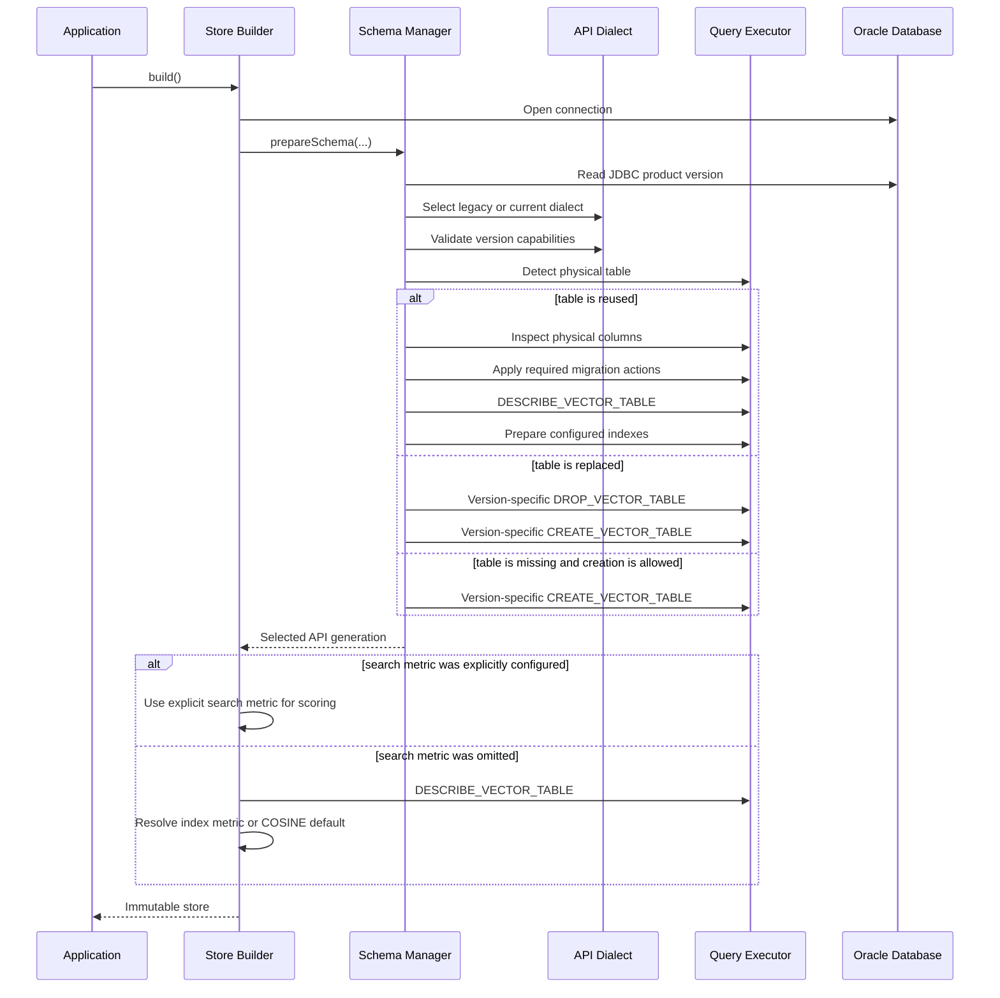

# Oracle VecDB Embedding Store Specification Updates

This document contains only the sections that must be added to or replaced in
`VECDB_EMBEDDING_STORE_SPEC 3.md`. Content from the original specification that is not named here remains unchanged.
The language is normative: `must` describes required behavior, while `should` describes a recommended refinement.

## 1. Project Definition Updates

### Replace the changed Goals and Non-goals bullets

The integration must support Oracle Database 23.26.1 and later. It must select the compatible
`DBMS_VECTOR_DATABASE` API generation from JDBC database metadata instead of assuming that every supported database
uses the 23.26.3 signatures and table shape.

Add these goals:

- Support Oracle Database 23.26.1 and later.
- Treat 23.26.1 and 23.26.2 as the legacy VecDB API generation.
- Treat 23.26.3 and later as the current VecDB API generation until another incompatible generation is introduced.
- Select version-specific PL/SQL signatures, index JSON, description parsing, and feature capabilities behind an API
  dialect boundary.
- Inspect the physical layout of reused tables and migrate legacy tables when they are used on 23.26.3 or later.
- Support optional and independent distance metrics for vector-index creation and similarity search.
- Convert every exposed metric's returned distance into a LangChain4j score in the range `[0, 1]`.
- Support direct deletion by metadata filter and direct deletion of every row without dropping the table or indexes.

Remove these former first-delivery non-goals:

- Metadata-filter deletion.
- General non-cosine score conversion.

Add these non-goals:

- Automatic downgrade of a current 23.26.3 table to the legacy 23.26.1 layout.
- Metadata indexes, parallel index creation, quantization, distribution, and other current-only index options on the
  legacy API generation.
- `HAMMING` and `JACCARD` metrics for the current FLOAT32 dense embedding contract.
- Automatic repair of an incompatible table that contains neither a recognizable legacy nor current layout.

### Replace the Cosine Compatibility design decision

**Independent, optional distance metrics**

The vector-index metric and the store search metric are separate configuration values:

- `VecDbVectorIndex.distanceMetric(...)` controls the metric written into the vector-index definition.
- `OracleVecDbEmbeddingStore.Builder.distanceMetric(...)` controls the metric sent in
  `SEARCH.advanced_options.distance_metric`.
- Either value may be omitted. An omitted value must not be serialized as an explicit metric, allowing Oracle to apply
  its documented metric-selection behavior.

The embedding model's recommended metric should be used consistently for index creation and search. When an explicit
search metric conflicts with the index metric, Oracle performs the search with the requested metric but cannot use the
vector index, so the query becomes an exact search. The Java API does not reject this configuration because the two
settings serve different purposes, but the behavior must be documented clearly.

When the search metric is omitted, the store must still know which formula to use to convert the returned distance to a
LangChain4j score. It resolves an effective metric after schema preparation from the database's table description. If
there is no vector index, or the index description contains no metric, the effective metric is `COSINE`, matching
Oracle's default for a single unindexed vector column.

### Replace the Requirements and Dependencies database row

| Requirement | Baseline |
| --- | --- |
| Oracle Database | 23.26.1 or later |
| Legacy API generation | 23.26.1 and 23.26.2 |
| Current API generation | 23.26.3 and later |
| Database API | Direct JDBC calls to the selected `DBMS_VECTOR_DATABASE` dialect |

## 2. Contracts and Compatibility Updates

### Replace the DBMS_VECTOR_DATABASE compatibility paragraph

`DBMS_VECTOR_DATABASE` is a versioned database boundary. Some operations, including vector upsert, search, listing,
and ID deletion, share one signature across the supported releases. Table lifecycle operations and index JSON do not.
The integration must resolve the API generation once during store construction and pass that selection through schema
preparation, table description, and index mapping.

| Capability | Shared or versioned | Owner |
| --- | --- | --- |
| Database version parsing | Versioned selection | `VecDbSupport` |
| API generation | Versioned selection | `VecDbApiVersion` |
| `CREATE_VECTOR_TABLE` signature | Versioned | `VecDbApiDialect` |
| `DESCRIBE_VECTOR_TABLE` signature | Versioned | `VecDbApiDialect` |
| `DROP_VECTOR_TABLE` signature | Versioned | `VecDbApiDialect` |
| Root index JSON | Versioned | Current and legacy index mappers |
| Description and index-state response | Versioned | Table-description mapper |
| Physical table layout | Versioned | Table layout and migration components |
| `CREATE_INDEX`, `DROP_INDEX`, `REBUILD_INDEX` calls | Shared call signature | JDBC executor |
| `UPSERT_VECTORS`, `LIST_VECTORS`, `SEARCH`, `DELETE_VECTORS` | Shared call signature | JDBC executor |

Physical table existence is different from VecDB catalog membership. A legacy table may remain in the schema after a
database upgrade while the newer `LIST_VECTOR_TABLES` response does not recognize it. Table lifecycle decisions must
therefore use JDBC `DatabaseMetaData` to detect the physical table. `LIST_VECTOR_TABLES` may still be used for VecDB
catalog operations, but it must not be the only existence check used by `CREATE_IF_NOT_EXISTS`.

### Replace the changed baseline rows

| LangChain4j convention | VecDB behavior |
| --- | --- |
| Search returns a normalized relevance score | Convert the effective Oracle distance metric into `[0, 1]` |
| Minimum score is applied locally | Filter converted results after VecDB returns top-k |
| Metadata filters require database translation | Use VecDB QBE for search and SQL predicates over the metadata JSON column for deletion |
| Existing table reuse must be non-destructive | Inspect and, where supported, migrate its physical layout before index preparation |

## 3. Architecture and Component Boundary Updates

### Replace the Internal Types table

The JSON mappers live in `dev.langchain4j.store.embedding.oracle.vecdb.mapper`. They form a separate mapping boundary
even where Java visibility must be public for access from the parent package.

| Type | Responsibility |
| --- | --- |
| `VecDbSchemaManager` | Coordinates version gating, capability validation, table lifecycle, layout migration, and independent vector/metadata index lifecycles |
| `VecDbQueryExecutor` | Defines the database operations needed by the store and schema manager without embedding JDBC details in either caller |
| `VecDbJdbcQueryExecutor` | Executes PL/SQL and direct DML, binds Oracle JSON values, reads CLOB responses, inspects JDBC metadata, and applies migration DDL |
| `VecDbApiVersion` | Identifies the supported legacy or current VecDB API generation |
| `VecDbApiDialect` | Supplies version-specific PL/SQL signatures, bindings, root index mapping, and capability validation |
| `VecDbApiDialectLegacy` | Implements the 23.26.1/23.26.2 package contract |
| `VecDbApiDialectNew` | Implements the 23.26.3-and-later package contract |
| `VecDbTableLayout` | Normalizes physical column names and classifies a table as legacy, current, partially migrated, or incompatible |
| `VecDbTableMigration` | Produces the ordered, resumable actions needed to align a reused table with the selected API generation |
| `VecDbEmbeddingTableJsonMapper` | Maps table parameters and annotations, parses both description shapes, discovers index state, and resolves the effective score metric |
| `VecDbIndexJsonMapper` | Produces the nested vector-index, metadata-index, and parallel-creation JSON used by 23.26.3 and later |
| `VecDbIndexJsonMapperLegacy` | Produces the flat vector-index JSON accepted by 23.26.1/23.26.2 and rejects unsupported options |
| `VecDbVectorJsonMapper` | Serializes upsert records and ID arrays and parses listed vectors |
| `VecDbSearchRequestMapper` | Maps a LangChain4j embedding request to query JSON, QBE filters, top-k, vector inclusion, and optional search metric JSON |
| `VecDbSearchResultMapper` | Validates VecDB results, converts metric-specific distances to LangChain4j scores, and reconstructs embeddings and text segments |
| `VecDbFilters` | Translates the supported LangChain4j filter tree into constrained VecDB QBE and validates filter semantics used by deletion |
| `VecDbSupport` | Parses the JDBC product version, enforces the minimum release, and resolves the API generation |
| `VecDbIndexBuilder` | Shares validation and fluent configuration between IVF and HNSW builders |

### Replace the Build Sequence



Capability validation must occur before table discovery, migration, drop, or creation. This ordering prevents a
`CREATE_OR_REPLACE` configuration from deleting a table before the application learns that its metadata index,
parallel creation, or advanced vector-index option is unsupported by the connected release.

### Replace the JSON Ownership Matrix rows for indexes and descriptions

| JSON document | Owner | API generation |
| --- | --- | --- |
| Legacy flat `index_params` | `VecDbIndexJsonMapperLegacy` | 23.26.1 and 23.26.2 |
| Nested root `index_params` | `VecDbIndexJsonMapper` | 23.26.3 and later |
| Legacy/current table description | `VecDbEmbeddingTableJsonMapper` | Both, selected by `VecDbApiVersion` |
| `query_by` and optional `advanced_options` | `VecDbSearchRequestMapper` | Shared search API |
| Search `results` | `VecDbSearchResultMapper` | Shared shape with metric-specific scoring |

## 4. Public API and Store Contract Updates

### Replace the Store Builder Contract

| Builder method | Required | Meaning |
| --- | --- | --- |
| `dataSource(DataSource)` | Yes | Supplies JDBC connections |
| `embeddingTable(...)` | Yes | Selects the table and lifecycle |
| `index(VecDbVectorIndex)` | No | Configures vector-index definition and lifecycle |
| `distanceMetric(VecDbDistanceMetric)` | No | Configures the independent search-time metric; omission delegates metric selection to Oracle |
| `metadataIndex(VecDbMetadataIndex)` | No | Configures metadata-index definition and lifecycle on supported releases |
| `parallelCreation(int)` | No | Configures current-generation root index-creation parallelism |
| `build()` | Yes | Resolves compatibility, prepares the schema, and resolves the effective score metric |

Example with matching index-time and search-time metrics:

```java
VecDbVectorIndex vectorIndex = VecDbVectorIndex.hnswIndexBuilder()
        .distanceMetric(VecDbDistanceMetric.COSINE)
        .accuracy(95)
        .neighbors(32)
        .efConstruction(128)
        .createOption(CreateOption.CREATE_IF_NOT_EXISTS)
        .build();

OracleVecDbEmbeddingStore store = OracleVecDbEmbeddingStore.builder()
        .dataSource(dataSource)
        .embeddingTable(table)
        .index(vectorIndex)
        .distanceMetric(VecDbDistanceMetric.COSINE)
        .build();
```

Calling neither distance-metric method is valid. The index mapper and search mapper must omit `distance_metric`, after
which Oracle applies its defaults. The store resolves the actual/defaulted metric separately so it can still produce
LangChain4j scores.

### Replace the VecDB Physical Table subsection

The physical layout depends on the release that created the table.

| API generation | Physical columns |
| --- | --- |
| 23.26.1/23.26.2 legacy | `ID`, `DENSE_VECTOR`, `METADATA` |
| 23.26.3 and later | `ID`, `DENSE_VECTOR`, `CONTENT_METADATA`, `SPARSE_VECTOR`, `CONTENT`, `CONTENT_TYPE` |

The logical upsert property remains `metadata`. On legacy tables it maps to `METADATA`; on current tables it maps to
`CONTENT_METADATA`. LangChain4j text continues to be stored under reserved metadata key `text` so search responses can
reconstruct a `TextSegment`.

`CONTENT` and `CONTENT_TYPE` are part of the current physical layout, but their presence does not prove that the
current `UPSERT_VECTORS` JSON accepts plain text and writes it to the BLOB. Until that contract is verified, the
compatibility payload continues to store text in metadata and the BLOB behavior remains a separate integration decision.

### Replace the Search and Removal operation rows

| Operation | Required behavior |
| --- | --- |
| `search(request)` | Send the dense query, top-k, optional QBE filter, vectors flag, and optional explicit search metric; preserve result order and apply metric-specific score conversion |
| `remove(String)` | Use the LangChain4j default path through one-ID removal |
| `removeAll(Collection<String>)` | Call `DELETE_VECTORS` with a JSON ID array |
| `removeAll(Filter)` | Validate supported filter semantics, translate the filter to a SQL predicate over `CONTENT_METADATA`, execute one parameterized `DELETE`, and commit when auto-commit is disabled |
| `removeAll()` | Execute `DELETE FROM <table>` and commit when auto-commit is disabled; preserve the table and all indexes |

## 5. Versioned Schema and Index Management

### Add API Generation Selection

`VecDbSupport` must read `DatabaseMetaData.getDatabaseProductVersion()`, find three-component versions such as
`23.26.3`, and use the last complete match because Oracle product strings can contain both a release and a full-version
value. Major, minor, and patch values are compared numerically.

| Reported database version | API generation | Dialect |
| --- | --- | --- |
| Earlier than 23.26.1 | Unsupported | None |
| 23.26.1 or 23.26.2 | `V23_26_1` | `VecDbApiDialectLegacy` |
| 23.26.3 or later | `V23_26_3` | `VecDbApiDialectNew` |

An unsupported version must raise `UnsupportedFeatureException`. An unparseable JDBC product string must raise
`IllegalStateException`. The selected generation is a capability family, not an exact database patch number. A future
breaking package release should add another enum value and dialect rather than adding version checks throughout the
store.

### Add Version-specific Package Signatures

Legacy table creation uses the 23.26.1 signature:

```sql
BEGIN
  ? := DBMS_VECTOR_DATABASE.CREATE_VECTOR_TABLE(
      table_name      => ?,
      description     => ?,
      auto_generate_id => FALSE,
      annotations     => ?,
      vector_type     => ?,
      index_params    => ?,
      debug_flags     => NULL,
      request_id      => NULL);
END;
```

Current table creation uses the 23.26.3 signature:

```sql
BEGIN
  ? := DBMS_VECTOR_DATABASE.CREATE_VECTOR_TABLE(
      name         => ?,
      comment      => ?,
      annotations  => ?,
      table_params => ?,
      embed_params => NULL,
      index_params => ?);
END;
```

Legacy `DESCRIBE_VECTOR_TABLE` and `DROP_VECTOR_TABLE` bind `table_name`; current calls bind `name`. Optional
`debug_flags` and `request_id` are omitted from describe and drop calls because their defaults are sufficient. Shared
data and index-management signatures remain in the JDBC executor instead of being duplicated across dialects.

### Replace Table Discovery and Existing-table Compatibility

Schema preparation must distinguish three questions:

1. Does a physical table with this name exist in the connected schema?
2. Which columns does that table currently contain?
3. Does its layout match the API generation selected from the database version?

The first question must use JDBC table metadata, not only `LIST_VECTOR_TABLES`. This is required for upgraded databases:
an old table can still physically exist even when the current VecDB catalog does not list it. Treating the table as
missing would make `CREATE_IF_NOT_EXISTS` call `CREATE_VECTOR_TABLE` and fail with `ORA-00955`.

The layout inspector normalizes column names and returns one of these states:

| State | Meaning |
| --- | --- |
| `LEGACY` | `ID`, `DENSE_VECTOR`, and `METADATA` are present with none of the current content columns |
| `CURRENT` | `ID`, `DENSE_VECTOR`, `CONTENT_METADATA`, `SPARSE_VECTOR`, `CONTENT`, and `CONTENT_TYPE` are present |
| `PARTIALLY_MIGRATED` | A recognizable metadata column exists, but one or more required current columns are missing |
| `INCOMPATIBLE` | Base columns are missing, both metadata columns coexist, or the layout cannot be migrated safely |

On 23.26.3 or later, migration is derived from the actual columns and may contain these ordered actions:

```sql
ALTER TABLE <table> RENAME COLUMN METADATA TO CONTENT_METADATA;
ALTER TABLE <table> ADD SPARSE_VECTOR VECTOR(*, *, SPARSE);
ALTER TABLE <table> ADD CONTENT BLOB;
ALTER TABLE <table> ADD CONTENT_TYPE VARCHAR2(256);
```

Only missing actions are executed, making an interrupted migration resumable. The resulting layout must be inspected
again and rejected if required actions remain. On 23.26.1/23.26.2, only the legacy layout is accepted; automatic
downgrade from the current layout is not supported.

### Replace the Root Index Parameters subsection

The legacy API accepts one flat vector-index document:

```json
{
  "indexing": "auto",
  "organization": "INMEMORY GRAPH",
  "distance_metric": "COSINE",
  "accuracy": 95,
  "advanced_params": {
    "neighbors": 32,
    "efConstruction": 128
  }
}
```

The current API accepts a root document that can contain independent vector and metadata index objects plus parallel
creation:

```json
{
  "vector_index_params": {
    "auto_index": true,
    "organization": "INMEMORY GRAPH",
    "distance_metric": "COSINE",
    "accuracy": 95,
    "advanced_params": {
      "neighbors": 32,
      "efConstruction": 128
    }
  },
  "metadata_index_params": {
    "auto_index": true
  },
  "parallel_creation": 4
}
```

In both shapes, `distance_metric` is optional and must be omitted when the index builder does not provide it. The
legacy mapper returns null when no managed vector index is configured. The current mapper keeps `CreateOption` separate
from index maintenance: `CreateOption` selects create/reuse/replace behavior, while `auto_index` controls whether VecDB
automatically maintains the requested index.

### Add the Version Capability Matrix

| Builder capability | 23.26.1/23.26.2 | 23.26.3 and later |
| --- | --- | --- |
| IVF and HNSW organization | Supported | Supported |
| Optional vector-index distance metric | Supported | Supported |
| Accuracy | Supported | Supported |
| Partitions, neighbors, `efConstruction` | Supported | Supported |
| Metadata indexes | Rejected | Supported |
| `parallelCreation` | Rejected | Supported |
| Quantization type and compression ratio | Rejected | Supported |
| Online build | Rejected | Supported |
| Distribution parameters | Rejected | Supported |
| HNSW rescore factor | Rejected | Supported |
| Quantization algorithm | Rejected | Supported |

### Replace the Distance Metric Invariant

The store exposes only metrics that can be used with its dense FLOAT32 vectors and for which it defines a LangChain4j
score conversion:

```text
COSINE
MANHATTAN
DOT
EUCLIDEAN
L2_SQUARED
EUCLIDEAN_SQUARED
```

`HAMMING` and `JACCARD` are not exposed. They are binary-vector metrics and do not match the FLOAT32 vectors produced
by the supported LangChain4j embedding flow. For example, maintaining a HAMMING index with FLOAT32 input can fail with
`ORA-51883`.

The index metric and search metric should normally match. A mismatch is allowed because it is valid Oracle behavior,
but it disables approximate use of that vector index and triggers exact distance evaluation with the search metric.

## 6. Search, Scoring, Filtering, and Removal Updates

### Replace Search Architecture and Request Mapping

`EmbeddingSearchRequest` supplies a query embedding, `maxResults`, `minScore`, and an optional LangChain4j `Filter`.
VecDB returns distances rather than LangChain4j relevance scores, so request mapping and response mapping have distinct
responsibilities.

| LangChain4j/store input | VecDB search input |
| --- | --- |
| `queryEmbedding()` | `query_by = {"vector":[...]}` |
| `maxResults()` | `top_k` |
| `filter()` | QBE `filters` JSON or typed JSON null |
| Explicit store metric | `advanced_options.distance_metric` |
| Omitted store metric | `advanced_options = NULL` |
| Result reconstruction requirement | `include_vectors = TRUE` |
| `minScore()` | Not sent; applied locally after conversion |

Index-time parameters and search-time parameters must not be confused. Index configuration controls how Oracle builds
and maintains the physical vector index. Search `advanced_options` controls an individual query. The current store API
exposes only search-time `distance_metric`; index `accuracy`, partitions, graph construction, quantization, and parallel
creation are not copied into search requests.

### Add Effective Metric Resolution

The metric sent to Oracle and the metric used for score conversion are related but not always sourced from the same
builder field.

| Configuration | Metric sent in search | Metric used for score conversion |
| --- | --- | --- |
| Store metric supplied | Explicit store metric | Explicit store metric |
| Store metric omitted, vector index with reported metric | Omitted | Reported vector-index metric |
| Store metric omitted, no vector index | Omitted | `COSINE` |
| Store metric omitted, index metric absent from description | Omitted | `COSINE` |

For legacy descriptions, vector-index existence is determined from non-blank `DENSE_IDX_NAME`, while the metric is
read from flat `INDEX_PARAMS.distance_metric`. `INDEX_PARAMS` alone describes configuration and is not sufficient proof
that the physical index exists. For current descriptions, index existence is read from returned index entries with
fallbacks to nested `INDEX_PARAMS`, and the metric is read from
`INDEX_PARAMS.vector_index_params.distance_metric`.

Description field lookup must be case-insensitive because legacy responses use uppercase names. Table description
must also accept legacy `DESCRIPTION` as the public `comment` fallback. If an existing index reports a metric outside
the supported enum, store construction must fail with `UnsupportedFeatureException`; returning scores using the wrong
formula would violate the LangChain4j contract.

### Replace Score Conversion

VecDB orders results by distance, where a lower distance normally means greater similarity. LangChain4j requires a
higher-is-better score in `[0, 1]`. The mapper must validate finite distance values and apply the formula associated
with the effective metric:

| Effective metric | Accepted distance | LangChain4j score |
| --- | --- | --- |
| `COSINE` | `[0, 2]` | `1 - (distance / 2)` |
| `EUCLIDEAN` | `distance >= 0` | `1 / (1 + distance)` |
| `MANHATTAN` | `distance >= 0` | `1 / (1 + distance)` |
| `L2_SQUARED` | `distance >= 0` | `1 / (1 + sqrt(distance))` |
| `EUCLIDEAN_SQUARED` | `distance >= 0` | `1 / (1 + sqrt(distance))` |
| `DOT` | Any finite value | `clamp(-distance, 0, 1)` |

The cosine formula maps identical vectors with distance `0` to score `1`, orthogonal vectors with distance `1` to
score `0.5`, and opposite vectors with distance `2` to score `0`. The squared-distance formulas take the square root
first so they have the same score scale as their unsquared distance equivalent.

Oracle's DOT distance is the negated inner product, so negating it restores a higher-is-better value. LangChain4j still
requires `[0, 1]`, therefore the result is clamped. This is a bounded compatibility mapping, not a universal
probability calibration: embeddings whose inner products fall outside `[0, 1]` can saturate at an endpoint.

`minScore` is applied after VecDB returns its top-k rows. No over-fetch is performed, so the final number of matches can
be smaller than `maxResults`.

### Replace First-delivery Search Limits

- Dense vector query only.
- No exact-search toggle; metric mismatch may cause Oracle's documented exact-search fallback.
- No text, hybrid, or sparse query.
- No output-selector API.
- Vectors requested for every result.
- No over-fetch for locally applied `minScore`.
- No HAMMING or JACCARD score conversion.

### Replace Removal Design

**ID deletion**

One or more IDs are serialized as a non-empty JSON array and passed to `DELETE_VECTORS`. Caller-provided values are
validated as non-blank before JDBC execution.

**Filter deletion**

`removeAll(Filter)` does not search and page IDs. It performs one direct DML operation against the physical table:

```sql
DELETE FROM <table> WHERE <translated metadata predicate>
```

The filter is first validated by `VecDbFilters` so the accepted LangChain4j filter surface stays aligned with VecDB
search. `SQLFilters` then maps flat metadata keys to `JSON_VALUE(CONTENT_METADATA, ...)` expressions and binds filter
values through `PreparedStatement` parameters. The operation commits when the acquired connection has auto-commit
disabled.

This approach avoids search top-k limits, paging races, and a separate list-then-delete window. Search and deletion use
different database representations of the same LangChain4j filter contract: QBE JSON for `SEARCH`, SQL JSON predicates
for direct deletion.

**Remove all**

`removeAll()` executes:

```sql
DELETE FROM <table>
```

It does not truncate, drop, or recreate the table. The operation preserves table annotations and vector/metadata
indexes and commits when auto-commit is disabled.

## 7. Database Integration and Operational Updates

### Replace the Executor Contract

```java
interface VecDbQueryExecutor {
    boolean vectorTableExists(Connection connection, String tableName);
    VecDbTableLayout inspectTableLayout(Connection connection, String tableName);
    void applyTableMigration(Connection connection, String tableName, MigrationAction action);
    String createVectorTable(Connection connection, VecDbApiVersion version, ...);
    String describeVectorTable(Connection connection, String tableName, VecDbApiVersion version);
    String dropVectorTable(Connection connection, String tableName, VecDbApiVersion version);
    IndexStatus indexStatus(Connection connection, String tableName, VecDbApiVersion version);
    String createIndex(...);
    String dropIndex(...);
    String rebuildIndex(...);
    String upsertVectors(...);
    String listVectors(...);
    String search(...);
    String deleteVectors(...);
    int deleteVectorsByFilter(...);
    int deleteAllVectors(...);
}
```

The executor receives an already-open connection and must not decide lifecycle policy or close that connection. The
schema manager decides which operations are needed; the store owns connections obtained from the `DataSource`; the
executor owns statements, readers, CLOB cleanup, and the mechanics of each call.

### Replace the Package Parameter Mapping rows for versioned calls

| Function | Legacy binding | Current binding |
| --- | --- | --- |
| `CREATE_VECTOR_TABLE` | `table_name`, `description`, `auto_generate_id`, `annotations`, `vector_type`, flat `index_params` | `name`, `comment`, `annotations`, `table_params`, `embed_params`, nested `index_params` |
| `DESCRIBE_VECTOR_TABLE` | `table_name` | `name` |
| `DROP_VECTOR_TABLE` | `table_name` | `name` |

All values accepted as PL/SQL values must use bind parameters. Direct deletion is different because an Oracle object
name cannot be bound. The configured table name becomes part of the DML statement, so table configuration is a trusted
application boundary and must not be populated directly from untrusted request input. Filter values remain bound.

### Replace the Version Capability Gate

VecDB operations require Oracle Database 23.26.1 or later.

- Read `DatabaseMetaData.getDatabaseProductVersion()` during store construction.
- Parse the last complete three-component numeric version.
- Reject versions earlier than 23.26.1 with `UnsupportedFeatureException`.
- Select the legacy dialect for 23.26.1 and 23.26.2.
- Select the current dialect for 23.26.3 and later.
- Validate release-specific schema features before any destructive or mutating schema operation.
- Reject an unparseable product version with `IllegalStateException`.
- Keep this gate scoped to `OracleVecDbEmbeddingStore`; it must not affect the separate Oracle store.

### Replace the changed Validation and Error bullets

- Store and vector-index distance metrics are optional.
- Any supplied metric must be one of the FLOAT32 metrics exposed by `VecDbDistanceMetric`.
- A search/index metric mismatch is allowed but must be documented as an exact-search fallback.
- Legacy database releases must reject current-only index features before schema mutation.
- Reused tables must have a compatible or safely migratable physical layout.
- A current table on a legacy database must fail; automatic downgrade is not supported.
- An unsupported metric discovered from an existing index must fail before search because no valid score conversion is
  available.
- Malformed table-description and search-response JSON must fail at the mapper boundary with `IllegalStateException`.

## 8. Constraints and Risks Updates

### Replace Metric Surface Broader than Store Support

The public metric surface is deliberately limited to dense FLOAT32 metrics with explicit score formulas. HAMMING and
JACCARD remain excluded. DOT scoring is bounded through clamping and may lose differentiation when raw inner products
fall outside `[0, 1]`; model-specific calibration is outside this integration's contract. The conversion formulas are
monotonic compatibility mappings, not claims that scores from different metrics are statistically equivalent.

### Replace Existing-table Compatibility

Version selection alone is insufficient because a database may be upgraded without migrating previously created
tables. Reused tables must be inspected by physical columns. Legacy and partially migrated layouts can be advanced to
the current shape on 23.26.3 or later, while incompatible layouts and downgrade scenarios must fail clearly.

The existence check must detect physical tables that the current VecDB catalog does not list. Otherwise
`CREATE_IF_NOT_EXISTS` can incorrectly attempt creation and produce `ORA-00955`.

### Replace Index-state Heuristics

`DESCRIBE_VECTOR_TABLE` response shapes vary by API generation. Legacy responses use case-insensitive fields such as
`DENSE_IDX_NAME` and a flat `INDEX_PARAMS`; current responses may report index entries and nested parameters. A legacy
metadata index is always reported as absent because that capability is unavailable. Fixture coverage is required for
every supported response generation.

### Replace Large Operations

- Batch upsert still needs a payload-size and chunking policy.
- Direct filter deletion can affect an unbounded number of rows and needs normal database workload controls.
- Direct remove-all is one potentially large `DELETE` transaction rather than a paged package operation.
- Local minimum-score filtering can reduce results below top-k.
- Physical migration DDL requires the privileges needed to rename and add columns and can leave a partial layout if an
  action fails; re-inspection and resumable action derivation are therefore required.

## 9. Delivery and Verification Updates

### Replace the version, schema, index, search, and removal deliverables

The delivery plan must additionally cover:

- Minimum version 23.26.1 and API-generation resolution.
- Legacy and current dialect classes.
- Legacy flat and current nested index mappers.
- Preflight rejection of unsupported legacy features.
- Physical table discovery independent of VecDB catalog membership.
- Legacy/current/partial/incompatible table classification.
- Resumable migration from legacy to current layout.
- Optional independent store and index metrics.
- Effective metric resolution from `DESCRIBE_VECTOR_TABLE`.
- Metric-specific score conversions and local thresholding.
- Direct SQL deletion by supported metadata filter.
- Direct SQL deletion of all rows while preserving schema and indexes.

### Replace the changed Verification Strategy bullets

**Unit coverage**

- Version parsing around 23.26.1, 23.26.2, and 23.26.3 boundaries.
- Dialect selection and exact PL/SQL named parameters.
- Legacy and current index JSON for null, IVF, and HNSW configuration.
- Rejection of every current-only feature on the legacy dialect before executor mutation.
- Table layout classification and each migration action.
- Idempotent continuation from every partially migrated layout.
- Legacy and current description parsing, index state, comment fallback, and effective metric resolution.
- Omission of search and index metrics when not configured.
- Explicit search metric independent from index metric.
- Every distance-to-score formula, invalid distance range, clamp boundary, and local `minScore` behavior.
- Filter deletion SQL parameter binding and remove-all transaction behavior.

**Integration coverage**

- One database from the 23.26.1/23.26.2 legacy generation.
- One database from the 23.26.3-or-later current generation.
- Reuse of a legacy table on a legacy database.
- Upgrade scenario in which a legacy physical table is reused on a current database and migrated.
- `CREATE_IF_NOT_EXISTS` must not attempt to recreate an upgraded legacy table.
- Legacy capability rejection for metadata indexes and newer vector-index options.
- Current vector and metadata index lifecycle.
- Search with explicit metric, implicit index metric, and no-index cosine default.
- Exact-search fallback when the explicit search metric differs from the index metric.
- Score conversion and minimum-score behavior for every exposed metric supported by the target database.
- Removal by ID, metadata filter, and all rows, with confirmation that the table and indexes remain.

### Replace the changed Acceptance Criteria

1. Oracle Database 23.26.1 and later is accepted; older versions fail before schema or data operations.
2. The correct API dialect and index JSON shape are selected from the database version.
3. Unsupported legacy features fail before any destructive schema operation.
4. `CREATE_IF_NOT_EXISTS` recognizes a physically existing legacy table after a database upgrade.
5. Reused tables are validated and safely migrated to the current layout where applicable.
6. Index-time and search-time distance metrics are optional and independent.
7. An omitted metric follows Oracle selection rules while the store resolves the same effective metric for scoring.
8. Every exposed metric produces a validated LangChain4j score in `[0, 1]`.
9. A documented metric mismatch uses Oracle's exact-search fallback rather than the vector index.
10. Filter removal and remove-all preserve the table and its indexes.
11. Legacy and current description responses produce the same reduced public table description.
12. Version-specific PL/SQL and JSON remain isolated behind dialect and mapper boundaries.

## 10. Open Decision Updates

Replace resolved or outdated questions with the following remaining decisions:

1. What exact `UPSERT_VECTORS` representation writes text to `CONTENT BLOB`, and what MIME value belongs in
   `CONTENT_TYPE`?
2. Should `CONTENT_METADATA.text` remain after reliable content retrieval becomes available?
3. Should automatic metadata indexing explicitly exclude the reserved `text` property?
4. Is the bounded DOT conversion acceptable for all supported models, or should DOT require a model-specific score
   calibration policy?
5. Should direct filter deletion expose workload limits or an application-level safeguard for very large deletes?
6. Should large upsert batches be split by record count, serialized byte size, or both?
7. Which future database version should trigger a new dialect instead of continuing to use `V23_26_3`?
8. Should a module-specific runtime exception replace generic wrapping of JDBC failures?
